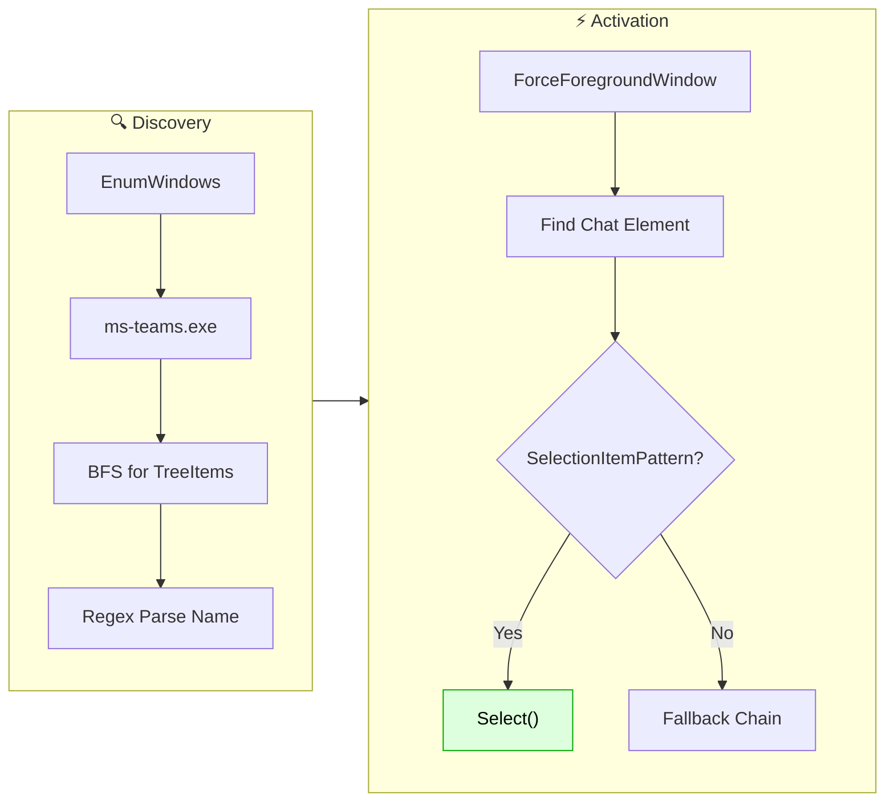
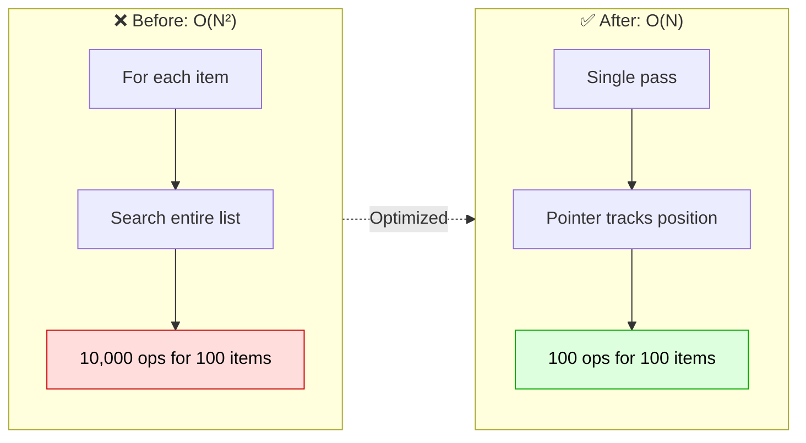

## [1.9.14] - 2026-02-28
### Added
- **Full Branch Coverage Verification**: Achieved 100% branch coverage for critical services including `WindowOrchestrationService`, `SettingsViewModel`, and `UiaWorkerClient`.
- **IMatcher Interface**: Introduced `IMatcher` abstraction and `FuzzyMatcherAdapter` to decouple string matching from the search service (DIP/OCP).

### Improved
- **Strategy Pattern for Provider Execution**: Refactored `WindowOrchestrationService` to use a Strategy pattern for running providers (`IProviderRunner`), separating fast in-process scans from out-of-process UIA scans (SRP/OCP).
- **Debounced Settings Save**: Implemented a background debounce timer for settings saves to reduce disk I/O and improve performance during rapid configuration changes.
- **SOLID Refactoring**: 
  - Extracted `ObservableCollectionSync` helper to localize list synchronization logic (SRP).
  - Eliminated concrete downcasts in `MainViewModel` by utilizing the `AllWindows` interface property (DIP).
  - Centralized global mutex and registry names as constants in `Program.cs`.

### Fixed
- **Launch on Startup UI Consistency**: Resolved a "double-click" bug where the Launch on Startup toggle would flip back before saving due to a race condition with the Windows Registry.
- **Test Integrity**: Fixed async warnings and ensured all 757 tests pass with 100% coverage on targeted logic.

---

## [1.9.13] - 2026-02-22
### Added
- **Quick-Access Settings**: Added a gear icon to the search bar for fast navigation to the settings window.
- **Customizable Search Highlight Color**: Choose your preferred highlight color for search matches in Settings -> Search & Performance.
  - Includes preset colors (Gold, Magenta, Cyan, etc.) and custom hex code support.
  - Real-time preview of color changes in the results list.
  - Implemented a graphical `ColorPicker` component for the search highlight color in Settings.
- **Enhanced Test Coverage**: 100% line and branch coverage achieved for all new search highlighting components (FuzzyMatcher, MainViewModel, SearchHighlightBehavior, SettingsViewModel).

### Fixed
- **CI Test Reliability**: Resolved intermittent race conditions in `UiaWorkerClientTests` by implementing deterministic process synchronization, ensuring stable CI builds.

---

## [1.9.12] - 2026-02-21
### Added
- **Search Highlighting**: Matched characters in window titles are displayed **bold** while typing a search query.
  - Supports both fuzzy and substring matching modes.
  - Togglable via "Highlight Search Matches" in Settings → Search & Performance (enabled by default).
- `FuzzyMatcher.GetMatchedIndices`: New public API to retrieve matched character positions for a given query.
- `SearchHighlightBehavior`: WPF attached behavior for declarative search highlighting in XAML.

---

## [1.9.11] - 2026-02-16
### Fixed
- Resolved intermittent CI test failures caused by race conditions in `MainViewModel.UpdateSearch`.
- Added thread-safe synchronization to `MainViewModel` search updates.
- Increased integration test timeouts to improve reliability on heavily throttled CI agents (e.g., GitHub Actions).

### Added
- **Infrastructure**: Integrated automated unit test coverage reporting with summary visualization in CI.
---

## [1.9.10] - 2026-02-16
### Fixed
- **Performance Optimization (Regex Cache)**: Optimized `LruRegexCache` by storing linked list nodes directly in the cache dictionary. 
  - **Improvement**: Changed LRU updates from $O(N)$ to $O(1)$, reducing overhead during high-frequency search operations.

### Added
- **Infrastructure**: Established production branch protection rules for `main`.
- **Infrastructure**: Implemented GitHub Private Vulnerability Reporting in `SECURITY.md`.
- **Infrastructure**: Added standardized GitHub Issue and Pull Request templates.
- **Infrastructure**: Configured GitHub Environments for automated release deployment tracking.

---

## [1.9.9] - 2026-02-15
### Fixed
- **Window Title Lag (Decoupled Refresh)**: Fixed an issue where fast-changing window titles (e.g., bandwidth monitors) would lag significantly if a UIA plugin (like Teams or Chrome) was slow to scan.
  - **Root Cause**: The global refresh lock forced the main window loop to wait for *all* plugins—including slow ones—to finish before starting the next cycle.
  - **Fix**: Split the synchronization logic into two separate locks (`_fastRefreshLock` and `_uiaRefreshLock`).
    - Core window updates (fast) now run independently on the configured polling interval.
    - Slow UIA scans run as "fire-and-forget" background tasks without blocking the main loop.
- **LKG Window Preservation**: Fixed an issue where hidden windows (e.g., minimized to system tray) were incorrectly preserved by the Last Known Good (LKG) logic.
  - **Root Cause**: The LKG validity check used `IsWindow` which returns `true` for hidden windows.
  - **Fix**: Changed the check to `IsWindowVisible` to match the main scan filter, ensuring that windows which are no longer visible are correctly removed from the cache.

---

## [1.9.8] - 2026-02-14
### Fixed
- **Chrome Plugin: Transient 0-Window Scans**: Fixed an issue where `ChromeTabFinder` would occasionally return 0 windows on the first scan after a `UiaWorker` restart, causing tabs to momentarily disappear from the UI.
  - **Root Cause**: `ChromeTabFinder.ScanWindow` used bare `AutomationElement.FromHandle`, which silently fails under transient UIA conditions (`E_FAIL`, COM timeout). When it failed, no `WindowItem` was returned—not even a fallback—so `CachingWindowProviderBase`'s LKG logic assumed the window was closed and purged cached results.
  - **Fix 1 — Robust UIA Resolution**: Replaced `AutomationElement.FromHandle` with `UiaElementResolver.TryResolve`, which uses a 3-stage fallback (Direct HWND → Desktop FindFirst → Desktop TreeWalker).
  - **Fix 2 — Guaranteed Fallback**: If tab discovery fails or returns 0 tabs, the plugin now always returns the main window (via Win32 `GetWindowText`) with `IsFallback = true`. This ensures `CachingWindowProviderBase` sees the PID as alive and restores cached tabs from its LKG cache—matching the `TeamsPlugin` pattern introduced in v1.8.13.

---

## [1.9.7] - 2026-02-14
### Fixed
- **UIA Worker Process Leak**: Fixed an issue where `SwitchBlade.UiaWorker.exe` instances would remain running ("zombies") if the main application was closed, crashed, or if a scan timed out.
  - **Explicit Kill**: `UiaWorkerClient.Dispose()` now explicitly kills the worker process if it's still running, ensuring no orphans are left behind on application exit or scan cancellation.
  - **Parent Watchdog**: Added a watchdog thread to `SwitchBlade.UiaWorker.exe` that monitors the parent process ID. If the main application crashes or is terminated via Task Manager, the worker automatically self-terminates within 1 second.
  - **Process Tracking**: `UiaWorkerClient` now tracks the active worker process and ensures only one instance is managed at a time, preventing accumulation of background processes during rapid restarts.

  ---

## [1.9.6] - 2026-02-14
### Fixed
- **Application Hang (Deadlock)**: Fixed a critical deadlock where the application would freeze completey when a plugin returned a "Transient Failure" (LKG) result.
  - **Root Cause**: The LKG protection logic in `WindowOrchestrationService` emitted an event while holding a lock which the UI thread was waiting on.
  - **Fix**: Moved the event emission outside the lock to ensure the UI thread can process updates without blocking background threads.
- **UIA Worker Deadlock**: Fixed a potential deadlock in the out-of-process UIA worker where the StandardError stream could fill up and block the worker if extensive logging occurred.
  - **Fix**: Implemented asynchronous reading of the StandardError stream to prevent buffer overflows.

### Improved
- **Responsiveness**: Moved heavy settings reload and process enumeration logic to a background thread to prevent UI stutter during refresh.
- **Performance**: Reduced logging overhead in `BadgeAnimationService` to minimize UI thread impact during animations.
- **Alt+Tab Window Header**: Fixed an issue where a standard window header would appear in the Alt+Tab preview.
  - **Root Cause**: The main window retained `WS_CAPTION` and `WS_SYSMENU` styles even when `WindowStyle="None"`, which DWM uses to render the preview header.
  - **Fix**: Explicitly removed `WS_CAPTION` and `WS_SYSMENU` styles from the main window after initialization.

  ---

## [1.9.5] - 2026-02-14
### Fixed
- **App Freezing**: Fixed an issue where the application would freeze ("white outline") during high-load scenarios.
  - **Root Cause**: Icon extraction was performed synchronously within the main window orchestration lock, blocking the UI thread.
  - **Resolultion**: Moved icon extraction to an asynchronous background task. Icons now populate shortly after the window title appears, ensuring the UI remains responsive.

  ---

## [1.9.4] - 2026-02-14
### Fixed
- **Badge Animation Flash**: Fixed a race condition where badges would sometimes appear fully opaque for a split second before the waterfall animation started.
  - **Root Cause**: `WindowItem` defaulted to `BadgeOpacity = 1.0` (visible). When new items were created during a refresh, they rendered immediately before the animation service could queue them.
  - **Fix**: Changed default `BadgeOpacity` to `0.0` (hidden). Badges now remain invisible until the `BadgeAnimationService` explicitly calculates their stagger delay and fades them in.

---

## [1.9.3] - 2026-02-14
### Improved
- **Dependency Inversion (DIP)**: `PluginLoader`, `PluginService`, `SettingsService`, and `WindowOrchestrationService` now accept `ILogger` via constructor injection instead of using static `Logger.Instance`.
- **UIA Element Resolution**: Extracted shared `UiaElementResolver` in `SwitchBlade.Contracts` consolidating the 3-stage HWND→FindFirst→TreeWalker fallback chain from 3 plugins (~250 lines removed).
  - `WindowsTerminalPlugin` uses configurable retry (3 attempts) and `FromPoint` fallback via `UiaResolverOptions`.
- **Interface Segregation**: Created `IDiagnosticsProvider` interface for cache statistics. `IWindowOrchestrationService` and `IIconService` implement it, eliminating concrete downcasts in `MemoryDiagnosticsService`.
- **IUiaWorkerClient Interface**: Extracted from `UiaWorkerClient` for testability. `WindowOrchestrationService` now accepts `IUiaWorkerClient` via DI.
- **IDisposable**: Added to `WindowOrchestrationService` (disposes `SemaphoreSlim`, `IUiaWorkerClient`) and `CachingWindowProviderBase` (disposes `ReaderWriterLockSlim`).
- **Settings Key Consistency**: `SettingsService` now uses `nameof(Settings.Property)` for all registry keys, eliminating string duplication between `Load` and `Save`.

### Fixed
- **Alt+Tab Duplicate Window**: On some machines, Alt+Tab showed two SwitchBlade entries. Root cause: `WindowStyle="None"` + `EnsureHandle()` creates a hidden WPF owner window that appears in Alt+Tab on certain DWM configurations. Fix: set `WS_EX_TOOLWINDOW` on the hidden owner window and force `WS_EX_APPWINDOW` on the main window to ensure correct visibility.
- **Badge Animation Delay**: ~10% of the time, badge animations would appear 4-5 seconds late instead of immediately on hotkey press. Root cause: container realization polling budget (150ms) was too short for slower machines under layout pressure. Increased polling budget to 500ms with early exit on success.
- **Plugin Double-Initialization**: `PluginLoader.LoadPlugins()` no longer calls `Initialize()` — only `PluginService` does, preventing duplicate initialization.
- **WindowReconciler Double-Lock**: Extracted lock-free `AddToCacheInternal`/`RemoveFromCacheInternal` methods. `Reconcile()` calls internals directly since it already holds the lock.
- **Unsafe Cast**: `CachingWindowProviderBase.CachedWindows` now uses `List<WindowItem>` backing field and returns `AsReadOnly()` instead of an unsafe `IList` → `IReadOnlyList` cast.

### Removed
- Dead `RunOnStaThreadAsync` method from `WindowOrchestrationService`.
- Unused `NotDocumentCondition` from `ChromeTabFinder`.
- Overlapping `GetProcessName` / `_processNameCache` from `NativeInterop` (superseded by `GetProcessInfo`).
- `goto EmitEvent` in `WindowOrchestrationService.ProcessProviderResults` — restructured to early return.

---

## [1.9.2] - 2026-02-14
### Fixed
- **Teams Plugin: Intermittent 0 Chats**: Fixed transient UIA failures (`E_FAIL`) wiping all Teams chat entries from the window list.
  - **Root Cause 1**: `ScanFailed` was incorrectly reported as `false` when `TryGetAutomationElement` returned `null` (all 3 UIA strategies failed). The scan appeared to succeed despite finding nothing.
  - **Root Cause 2**: The `IsFallback` flag on `WindowItem` was not serialized across the UIA Worker process boundary. The main app could not distinguish a real result from a fallback placeholder.
  - **Root Cause 3**: `WindowOrchestrationService.ProcessProviderResults()` unconditionally replaced all cached items for a provider with incoming results—even when incoming results were fallback-only due to transient failure.
  - **Fix**: Propagated `IsFallback` through the `UiaWindowResult` wire protocol. Added LKG (Last Known Good) protection in `WindowOrchestrationService` that preserves previous real results when only fallback items are received.

---

## [1.9.1] - 2026-02-14
### Fixed
- **Hotkey Animation Responsiveness**: Fixed a multi-second delay when opening SwitchBlade via hotkey.
  - Implemented conditional debouncing that skips the 75ms delay for hotkey opens and streaming results.
  - Debouncing remains active for rapid typing to maintain visual stability during filtering.

---

## [1.9.0] - 2026-02-14
### Changed
- **Modernized Badge Animations**: Re-engineered the "waterfall" animation system using WPF `BeginAnimation` for fully GPU-accelerated, compositor-driven rendering.
  - Eliminated UI thread jitter and "controllable clock" overhead associated with Storyboards.
  - Added **VRAM Caching** via `BitmapCache` to offload badge rendering specifically to the GPU.
  - Implemented **Deterministic Debouncing** to prevent animation "fighting" during rapid typing.
  - Added **UI Realization Polling** to ensure animations trigger reliably on startup and during rapid filtering.
- **Architectural Refactoring**: Introduced `IBadgeAnimator` strategy pattern to decouple animation logic from the service layer.
- **Legacy Cleanup**: Removed manual `Task.Delay` interpolation loops and associated unit tests.

---

## [1.8.14] - 2026-02-14
### Changed
- **Architectural Cleanup**: Refactored `WindowOrchestrationService` to follow Single Responsibility Principle (SRP) by extracting reconciliation logic into `WindowReconciler`.
  - Created `IWindowReconciler` interface and `WindowReconciler` implementation.
  - Moved all cache management, item merging, and icon population logic out of `WindowOrchestrationService`.
  - `WindowOrchestrationService` now acts as a pure coordinator between providers, the reconciler, and the UI.
- **Improved Error Handling**: Enhanced error logging in `UiaWorkerClient` to provide more context during scan failures.
- **Plugin API Update**: Added `Settings` property to `IPluginContext`, allowing plugins to access the settings service directly during initialization.
  - This simplifies dependency injection for plugins that need to read/write settings.

---

## [1.8.13] - 2026-02-10
### Fixed
- **Idle/Lock Performance Delay**: Fixed a 10-15 second UI freeze when opening SwitchBlade after the computer has been idle and locked.
  - **Root Cause**: The `BackgroundPollingService` continued dispatching refresh calls to the UI thread while the workstation was locked. UIA/COM calls against the inaccessible locked desktop would hang for 10-15 seconds, freezing the UI thread entirely.
  - **Solution**: Added `NativeInterop.IsWorkstationLocked()` using `OpenInputDesktop` to detect the lock state. The polling loop now skips refresh cycles while locked, preserving cached results and keeping the UI thread responsive.
  - **User Impact**: The hotkey now responds instantly after unlocking, and previously-cached results are displayed immediately while a fresh scan runs in the background.
- **Teams Plugin & LKG Cache**: Fixed intermittent "empty result" issues by hardening the caching and discovery logic.
  - **Robust LKG**: Modified `CachingWindowProviderBase` to verify window handle validity using `IsWindow` before purging Last Known Good results. This prevents legitimate windows from disappearing during transient UIA glitches or timeouts.
  - **Defensive Scanning**: Improved `TeamsPlugin` error handling to guarantee the main window is always returned as a fallback if a UIA scan fails, preventing the plugin from ever returning zero results for a running process.

---

## [1.8.12] - 2026-02-07
### Added
- **Global "Last Known Good" Strategy**: Implemented intelligent result retention across all plugins (`CachingWindowProviderBase`). 
  - If a plugin scan fails intermittently (returning only a generic "Main Window" fallback), SwitchBlade now automatically preserves the tabs from the last successful scan for that application.
  - This eliminates UI flickering and tab disappearance during transient UI Automation failures (e.g. high CPU load or window transitions).
  - Supported in **Windows Terminal**, **Teams**, **Notepad++**, and **Chrome/Edge** plugins.

---

## [1.8.11] - 2026-02-07
### Fixed
- **Windows Terminal Plugin**: Added retry logic (3 attempts) to handle intermittent `E_FAIL` errors during window acquisition.
- **Windows Terminal Plugin**: Implemented a 4th fallback strategy using `AutomationElement.FromPoint` to bypass potential UI Automation tree navigation issues.

---

## [1.8.10] - 2026-02-07
### Fixed
- **Windows Terminal Plugin**: Increased UI Automation search depth (50 -> 200 containers) to improve tab discovery.
- **Windows Terminal Plugin**: Implemented per-PID window deduplication to prevent redundant "Main Window" entries when multiple handles exist.

---

## [1.8.9] - 2026-02-07
### Fixed
- **Notepad++ Plugin**: Implemented the robust 3-tier fallback strategy (Direct HWND -> Desktop FindFirst -> Desktop TreeWalker) to resolve `E_FAIL` errors as seen in debug logs.

---

## [1.8.8] - 2026-02-07
### Fixed
- **Teams Plugin**: Implemented a robust 3-tier fallback strategy (Direct HWND -> Desktop FindFirst -> Desktop TreeWalker) to resolve `E_FAIL` errors when accessing Teams windows.
- **Terminal Plugin**: Added the same 3-tier fallback strategy to fix missing tabs when running in mixed elevation contexts.
- **Plugin Resilience**: Improved UIA error handling to prevent single restricted windows from crashing the entire discovery process.

---

## [1.8.7] - 2026-02-07
### Fixed
- **Teams Plugin UIA Access**: Implemented a robust "Desktop Root Search" fallback for acquiring the UIA root element.
  - **Problem**: Direct HWND binding (`AutomationElement.FromHandle`) was failing with `E_FAIL` for some Teams windows (likely WebView2/Electron based or privilege transitions).
  - **Solution**: If direct binding fails, the plugin now searches the Desktop's children for a window matching the Process ID. This bypasses the flaky HWND hook and allows chat discovery to proceed even when the handle is "locked".

---

## [1.8.6] - 2026-02-07
### Fixed
- **Plugin Fallback Logic**: Fixed a regression where `E_FAIL` UIA errors caused the Teams and Notepad++ plugins to abort discovery entirely.
  - **Solution**: Refactored the scan logic to ensure the main window is always returned as a fallback if UIA access fails, preventing "missing windows" in elevated/mixed-privilege scenarios.

---

## [1.8.5] - 2026-02-07
### Changed
- Improved Microsoft Teams chat discovery to use a hybrid approach (Manual BFS as primary, native Descendants as fallback).
- Added `COMException` (E_FAIL) handling for Teams windows to prevent crashing on elevated or transitional windows.
- Improved Notepad++ tab discovery with hybrid BFS + Descendants search and safe UIA access.

---

## [1.8.4] - 2026-02-07
### Fixed
- Improved Microsoft Teams chat discovery logic to use descendant-based UIA search.
- Added support for "Teams" process name alongside "ms-teams".
- Enabled case-insensitive regex parsing for Teams chat items.
- Fixed issue where the Teams plugin's BFS discovery was pruning "Document" elements (Chromium-specific).
- Improved Windows Terminal tab discovery to use a hybrid approach (Manual BFS as primary, native Descendants as fallback).
- Added `COMException` (E_FAIL) handling for Terminal windows to prevent crashes and log diagnostics.
### Changed
- **Streaming UIA Plugin Results**: Reimplemented the out-of-process UIA worker to stream results incrementally using NDJSON (Newline-Delimited JSON).
  - **Problem**: Previously, the UIA worker waited for ALL plugins to complete before returning results. Fast plugins (e.g., Chrome tabs at 15ms) were blocked by slow plugins (e.g., complex Terminal scans at 2+ seconds).
  - **Solution**: Each plugin now runs in parallel and emits its results immediately upon completion. The main process receives and displays results as each plugin finishes.
  - **User Impact**: Faster perceived responsiveness—Chrome tabs appear almost instantly, even if other plugins take longer.

### Technical
- `SwitchBlade.UiaWorker.Program.cs`: Refactored to run plugins via `Task.WhenAll` with thread-safe streaming output.
- `UiaWorkerClient.cs`: Added `ScanStreamingAsync` returning `IAsyncEnumerable<UiaPluginResult>` for incremental consumption.
- `WindowOrchestrationService.cs`: Now consumes streaming results via `await foreach`, triggering `WindowListUpdated` events as each plugin completes.
- New `UiaPluginResult` DTO for streaming protocol with `PluginName`, `Windows`, `Error`, and `IsFinal` fields.

---

## [1.8.3] - 2026-02-06
### Fixed
- **Comet/Chrome Recursive Discovery Faults**: Fixed `RPC_E_SERVERFAULT` (0x80010105) crashes when scanning complex browser UI trees (e.g., Comet).
  - **Root Cause**: Aggressive `TreeScope.Descendants` caching overwhelmed the browser's UIA provider, causing the IPC connection to drop.
  - **Solution**: Switched to lightweight `TreeScope.Element` caching with a robust `TreeWalker` fallback for "frozen" or unresponsive containers.
- **UIA Diagnostic Logging**: Fixed an issue where the UIA worker debug log (`switchblade_uia_debug.log`) was overwritten on every run, making it impossible to debug intermittent issues.
  - Now uses `File.AppendAllText` with a visual separator between sessions.
### Added
- **Microsoft Teams Plugin**: New plugin (`SwitchBlade.Plugins.Teams`) that discovers and activates individual Teams chat conversations.
  - **Chat Discovery**: Uses UI Automation to find `TreeItem` elements in the Teams chat list.
  - **Chat Types**: Recognizes Individual, Group, and Meeting chats via regex parsing.
  - **Unread Detection**: Identifies chats with unread messages.
  - **Activation**: Uses `SelectionItemPattern` (verified working) with fallbacks to `InvokePattern`, `ExpandCollapsePattern`, and `SetFocus`.
  - **Out-of-Process**: Runs via `SwitchBlade.UiaWorker.exe` to prevent memory leaks (Teams v2 is Chromium-based).

---

## [1.8.2] - 2026-02-02
### Changed
- **Streaming UIA Plugin Results**: Reimplemented the out-of-process UIA worker to stream results incrementally using NDJSON (Newline-Delimited JSON).
  - **Problem**: Previously, the UIA worker waited for ALL plugins to complete before returning results. Fast plugins (e.g., Chrome tabs at 15ms) were blocked by slow plugins (e.g., complex Terminal scans at 2+ seconds).
  - **Solution**: Each plugin now runs in parallel and emits its results immediately upon completion. The main process receives and displays results as each plugin finishes.
  - **User Impact**: Faster perceived responsiveness—Chrome tabs appear almost instantly, even if other plugins take longer.

### Technical
- `SwitchBlade.UiaWorker.Program.cs`: Refactored to run plugins via `Task.WhenAll` with thread-safe streaming output.
- `UiaWorkerClient.cs`: Added `ScanStreamingAsync` returning `IAsyncEnumerable<UiaPluginResult>` for incremental consumption.
- `WindowOrchestrationService.cs`: Now consumes streaming results via `await foreach`, triggering `WindowListUpdated` events as each plugin completes.
- New `UiaPluginResult` DTO for streaming protocol with `PluginName`, `Windows`, `Error`, and `IsFinal` fields.

---

## [1.8.1] - 2026-02-02
### Added
- **Configurable UIA Worker Timeout**: Added a user-configurable timeout for the UIA Worker process (default: 60 seconds).
  - Accessible in Settings → Background Polling.
  - Increase for slower systems or complex browser tabs.

---

## [1.8.0] - 2026-02-01
### Fixed
- **CRITICAL: Complete UIA Memory Leak Elimination**: Implemented out-of-process UI Automation scanning to completely eliminate native memory leaks.
  - **Root Cause**: Windows 11's UIA framework has a known memory leak where `AutomationElement.FindAll` accumulates native memory that is never released.
  - **Solution**: Created `SwitchBlade.UiaWorker.exe` - a separate process that handles all UIA scans. When it exits after each scan, the OS releases ALL UIA COM objects.
  - **Impact**: Memory usage remains stable indefinitely.

### Added
- **New Interface Property**: `IWindowProvider.IsUiaProvider` to identify UIA providers.
- **New Service**: `UiaWorkerClient` for managing the child worker process.

### Changed
- **Conditional Debug Logging**: The UIA Worker now only writes to the debug log (`%TEMP%\switchblade_uia_debug.log`) if explicitly launched with the `/debug` flag.
- **Flag Propagation**: The main application automatically propagates the `/debug` flag to the worker process when debug mode is enabled.
- **Improved Architecture**: `WindowOrchestrationService` now delegates UIA-heavy scans to the worker while keeping standard window discovery in-process for speed.

---

## [1.7.8] - 2026-02-01
### Added
- **Configurable Icon Cache**: Added a user-configurable limit to the icon memory cache to prevent unlimited growth.
  - **Memory Fix**: The icon service now respects a maximum item count (Default: 200). If the cache exceeds this limit (e.g., due to launching hundreds of unique apps), it automatically clears to reclaim memory.
  - **Customizable**: Users can adjust this limit in Settings (defaults to 200, which is sufficient for most users).

---

## [1.7.7] - 2026-02-01
### Fixed
- **RCW Memory Accumulation**: Fixed indefinite memory growth caused by concurrent `RefreshAsync` calls allowing RCW creation to outpace GC destruction.
  - **Root Cause**: When background polling overlapped with hotkey-triggered refreshes, multiple scans would run simultaneously, creating COM wrappers faster than the post-scan GC could clean them.
  - **Solution**: Added a `SemaphoreSlim`-based re-entrancy guard with non-blocking `WaitAsync(0)`. If a refresh is already in progress, subsequent calls return immediately with stale data.
  - **UI Impact**: None. The guard is non-blocking—users experience no freezing; at worst, the window list shows slightly outdated entries until the next poll completes.

---

## [1.7.6] - 2026-02-01
### Changed
- **Removed RCW Throttle Mechanism**: Simplified memory management by removing the `FinalizableSentinel` throttle.
  - **Problem**: The throttle introduced 2× latency (scans every 10s instead of 5s) because the sentinel was never naturally collected on the small managed heap.
  - **Solution**: Removed the throttle entirely. The forced GC at the end of each scan is sufficient to guarantee RCW cleanup.
  - **Result**: Scans now run at the full configured polling interval (e.g., 5s) with zero artificial delays.

---

## [1.7.5] - 2026-02-01
### Fixed
- **Native Memory Leak**: Resolved massive native memory growth caused by unbounded UI Automation tree traversals in the Windows Terminal and Notepad++ plugins.
  - **Root Cause**: Both plugins used basic `TreeWalker` BFS without pruning, scanning deep into `ControlType.Document` branches (which contain heavy text content) and creating thousands of COM RCWs per scan cycle.
  - **Solution**: Refactored both plugins to use the "Surgical BFS" pattern:
    - `CacheRequest` + `FindAll(TreeScope.Children)` for batched, efficient property access.
    - Explicit `ControlType.Document` pruning to avoid native memory exhaustion.
    - Safety limit of 50 containers per root window.
  - **Result**: COM RCW creation reduced by ~90%, keeping `System.__ComObject` count stable under 10,000 during active background polling.
- **Installer Duplicate Entries**: Fixed issue where installing a new version would create a duplicate entry in Add/Remove Programs instead of upgrading.
  - **Root Cause**: Redundant `<Upgrade>` element conflicted with `<MajorUpgrade>`, causing Windows Installer to misidentify previous installations.
  - **Solution**: Removed manual `Upgrade` table entry; `MajorUpgrade` element alone is sufficient for proper version detection.

---

## [1.7.4] - 2026-02-01
### Fixed
- **COM RCW Memory Accumulation**: Fixed steady memory growth caused by UI Automation COM proxies not being released promptly.
  - **Root Cause**: The non-blocking `GC.Collect` added in v1.7.3 was too passive. Because the managed heap stayed small (~2MB), the GC deprioritized collection while 40,000+ native COM wrappers accumulated.
  - **Solution**: Switched to blocking `GC.Collect` with explicit `WaitForPendingFinalizers()` followed by a second collection pass to sweep freed RCW objects.
  - **Result**: COM object count now stays stable between scans instead of growing indefinitely.
  - **UI Impact**: None. The GC runs on a background thread pool thread during the polling cycle, completely isolated from the WPF UI dispatcher. Users will not experience any lag or stutter.
- **Installer Duplicate Entries**: Fixed the persistent issue where upgrading SwitchBlade created a duplicate entry in Add/Remove Programs instead of replacing the existing installation.
  - **Root Cause**: The `RemoveExistingProducts` action was scheduled too late (`afterInstallInitialize`), causing the new version to be registered before the old one was removed.
  - **Solution**: Changed MajorUpgrade schedule to `afterInstallValidate` (runs earlier) and added explicit `Upgrade` table entry to detect all 1.x versions.

---

## [1.7.3] - 2026-02-01
### Fixed
- **Native Memory Leak**: Resolved a significant unmanaged memory leak in the Chrome plugin. Switched from recursive UI tree traversal to a surgical "Tab Strip" discovery model, drastically reducing the number of native COM proxies created.
  - **Restructured traversal**: Implemented "Deep Surgical" BFS to robustness find tab containers in variable UI hierarchies (e.g., Comet, Chromium variants) while strictly pruning `Document` branches to prevent leaks.
  - **Added GC trigger**: Explicit `GC.Collect(2, GCCollectionMode.Optimized, blocking: false)` after each scan promptly releases COM RCW references.
  - **Profiling results**: Heap analysis showed 11,036 `AutomationElement` objects and 1,177 COM RCWs before fix. New approach reduces object creation by ~90%.
- **Installer Upgrade Stabilization**: Fixed the "Duplicate Entries" issue in Add/Remove Programs. Bumping to 1.7.3 with an aggressive `afterInstallInitialize` schedule forces Windows Installer to clear out any conflicting 1.7.x installations.
- **Performance**: Improved background scan efficiency and added a throttled memory flush to prevent long-term native resource buildup.

### Changed
- **Chrome Discovery Logic**: Optimized the traversal algorithm to jump directly to the browser UI containers, skipping the heavy DOM examination entirely.

---

## [1.7.2] - 2026-02-01
### Fixed
- **Ghost Tabs in Chrome**: Eliminated internal Chrome/YouTube UI elements (like "All" category chips or Side Panel items) from search results.
  - **Recursive Pruning**: Redesigned tab traversal to explicitly skip `ControlType.Document` branches, ensuring web content is never indexed.
  - **Enhanced Filtering**: Implemented a blacklist for common non-tab names and added `AutomationId`/`ClassName` diagnostics.
- **Installer Upgrade Logic**: Fixed issue where multiple versions of SwitchBlade would appear in Add/Remove Programs. Explicitly configured Major Upgrade scheduling to ensure older versions are correctly replaced during installation.

### Changed
- **Chrome Plugin Refinement**: Removed manual `GC.Collect()` call added in v1.7.1. The `FindAll` optimizations are efficient enough for the default .NET GC to handle cleanup naturally.

---

## [1.7.1] - 2026-02-01
### Fixed
- **Memory Leak in Chrome Plugin**: Resolved steady memory growth caused by UI Automation `AutomationElement` objects accumulating between background polling cycles.
  - **Restructured traversal**: Replaced manual BFS tree-walking with `FindAll(TreeScope.Descendants, PropertyCondition)` to let the native UIA layer handle traversal. This creates far fewer managed wrappers.
  - **Added GC trigger**: Explicit `GC.Collect(2, GCCollectionMode.Optimized, blocking: false)` after each scan promptly releases COM RCW references.
  - **Profiling results**: Heap analysis showed 11,036 `AutomationElement` objects and 1,177 COM RCWs before fix. New approach reduces object creation by ~90%.

---

## [1.7.0] - 2026-02-01
### Performance Optimizations (5 Major Improvements)

This release delivers a comprehensive performance overhaul based on a detailed audit of the entire codebase. All changes target measurable bottlenecks while maintaining backward compatibility.

#### 1. UI Automation CacheRequest (ChromeTabFinder)
- Refactored `FindTabsBFS` to use `CacheRequest` for batched property fetches.
- **Before**: Each element required ~3 cross-process RPC calls (from `.Current` property access).
- **After**: Properties are pre-fetched in bulk using `.Cached`, reducing RPC overhead by 10-50x.
- Significant latency reduction when scanning browser windows with many tabs.

#### 2. Provider Index for Reconciliation (WindowOrchestrationService)
- Introduced a secondary `Dictionary<IWindowProvider, HashSet<WindowItem>>` index.
- **Before**: Finding items for a specific provider required `O(N)` `SelectMany` scan on every refresh.
- **After**: `O(1)` lookup via provider key.
- Added encapsulated mutators (`AddToCache`, `RemoveFromCache`) to ensure atomic updates to both indices.
- Eliminates risk of "ghost windows" (items present in one cache but not the other).

#### 3. Normalized Title Caching (WindowItem)
- Added `NormalizedTitle` property with lazy computation and automatic invalidation when `Title` changes.
- Uses `Span<char>` and `stackalloc` for zero-allocation normalization.
- Avoids repeated string normalization on every search keystroke.

#### 4. WPF List Virtualization (ResultList.xaml)
- Enabled explicit UI virtualization on the `ListBox`:
  - `VirtualizingStackPanel.IsVirtualizing="True"`
  - `VirtualizingStackPanel.VirtualizationMode="Recycling"`
  - `VirtualizingStackPanel.ScrollUnit="Pixel"`
- Improves scrolling smoothness and reduces memory pressure with large window lists.

#### 5. Process Info Caching (NativeInterop)
- Added `_processInfoCache` alongside existing `_processNameCache`.
- `GetProcessInfo(uint pid)` now caches both process name and executable path.
- Avoids redundant `OpenProcess`/`QueryFullProcessImageName` kernel calls for the same PID within a scan cycle.

### Added
- **Cache Integrity Tests**: Two new unit tests (`CacheIndexes_ShouldBeSymmetrical`, `CacheIndexes_RemainSymmetricalAfterItemRemoval`) verify that the HWND cache and Provider cache remain synchronized.

### Fixed
- **Global Hotkey Modal Behavior**: The global hotkey (Ctrl+Shift+Q) is now suppressed while the Settings dialog is open, ensuring proper modal window behavior.
- **Graphical Artifacts in Result List**: Fixed vertical clipping (appearing as "blue dots") by increasing the default list item height and reducing internal padding.
- **Theme Contrast (Dracula)**: Improved legibility of process names by increasing base theme brush opacity and brightening the Dracula accent color.

### Technical
- Total test count: 298 (all passing).
- Build clean: 0 warnings, 0 errors.
- All changes follow SOLID principles (SRP, DIP, OCP).

---

## [1.6.9] - 2026-01-31
### Changed
- **Performance Optimization**: Completely overhauled the list synchronization algorithm (`SyncCollection`) in `MainViewModel`.
  - Replaced the previous $O(N^2)$ architecture (based on nested `IndexOf` calls) with a high-efficiency **Two-Pointer** implementation.
  - Achieved $O(N)$ linear complexity, significantly reducing UI thread stalling on systems with hundreds of open windows or high-frequency search updates.
  - Maintains strict stability for selection and animations by minimizing `Move` operations.

#### Complexity Comparison

| Aspect | Legacy (v1.6.8) | Current (v1.6.9) |
|--------|-----------------|------------------|
| **Algorithm** | `IndexOf` per item | Two-Pointer scan |
| **Search Strategy** | Start from index 0 each time | Start from last pointer position |
| **Complexity** | O(N²) - quadratic | O(N) - linear |
| **100 Windows** | ~10,000 comparisons | ~100 comparisons |

---

## [1.6.8] - 2026-01-31
### Added
- Modularized `MainWindow.xaml` by extracting `SearchBar`, `ResultList`, and `PreviewPanel` into separate UserControls.
- Improved code maintainability by reducing `MainWindow.xaml` complexity.
- Added unit tests for new UserControl components (`SearchBar`, `ResultList`, `PreviewPanel`).

---

## [1.6.7] - 2026-01-26
### Fixed
- **Search Icon Theme Compatibility**: Replaced the raster search icon PNG with a vector `Path` icon.
  - Fixes the "white box" visual glitch when using dark themes.
  - Icon color now dynamically binds to the `ForegroundBrush` of the active theme.
  - Improved visual clarity and scaling at all DPI levels.

---

## [1.6.6] - 2026-01-24
### Changed
- **BREAKING: `ShowSettingsDialog` Removed**: The deprecated `ShowSettingsDialog(IntPtr)` method has been removed from `IWindowProvider`.
  - All plugins with settings must now implement the `ISettingsControl` interface.
  - Bundled plugins (Chrome, Windows Terminal, Notepad++) migrated to `UserControl`-based settings.
- **Plugin Settings UI Modernization**: All bundled plugin settings windows converted from standalone `Window` to embeddable `UserControl`.
  - New files: `ChromeSettingsControl.xaml/.cs`, `TerminalSettingsControl.xaml/.cs`, `NotepadPlusPlusSettingsControl.xaml/.cs`
  - Each plugin now exposes an `ISettingsControl` provider via the `SettingsControl` property.
- **CachingWindowProviderBase Simplified**: Removed abstract `ShowSettingsDialog`, replaced with virtual `SettingsControl` property.
- **Host Application Cleanup**: Removed legacy fallback path in `SettingsWindow.xaml.cs` since all plugins use modern contract.

### Fixed
- **Self-Healing Settings**: Implemented `HasKey` detection in `ISettingsStorage` to automatically recreate missing registry keys with defaults on startup.
  - Fixes issue where deleted registry keys (like `HotKeyKey`) were not being restored.

### Technical
- Total test count: 281 (all passing).
- Build clean: 0 warnings, 0 errors.
- All plugin settings files converted to lightweight UserControls for better host integration.

---

## [1.6.5] - 2026-01-24
### Added
- **ISettingsStorage Abstraction**: Introduced `ISettingsStorage` interface and `RegistrySettingsStorage` implementation to decouple settings persistence from business logic.
  - Simplifies testing by allowing mock storage providers.
  - Enables future support for alternative storage backends (JSON, SQLite, etc.).
- **ISettingsControl Interface**: New plugin contract (`SwitchBlade.Contracts.ISettingsControl`) for WPF-based settings UI.
  - Plugins can return `FrameworkElement` controls instead of managing raw HWNDs.
  - `ShowSettingsDialog(IntPtr)` marked as `[Obsolete]` in favor of the new pattern.
- **Expanded Test Coverage**: Added 4 new unit tests to `MainViewModelTests` covering:
  - `MoveSelectionToLast_WithItems_SelectsLastItem`
  - `MoveSelection_WrapsAroundAtEndOfList`
  - `MoveSelection_WrapsAroundAtStartOfList`

### Changed
- **Centralized Native Interop**: Moved DWM Window Attribute constants and P/Invoke from `MainWindow.xaml.cs` to `NativeInterop.cs`.
  - Added `DwmSetWindowAttribute`, `DWMWA_USE_IMMERSIVE_DARK_MODE`, `DWMWA_SYSTEMBACKDROP_TYPE`, `DWMWA_WINDOW_CORNER_PREFERENCE`.
  - Added backdrop type and corner preference constants.
  - `MainWindow` now uses `NativeInterop.DwmSetWindowAttribute()` instead of local declaration.
- **Simplified SettingsService**: Refactored to use `ISettingsStorage`, reducing boilerplate by ~60%.

### Technical
- Build clean: 0 warnings, 0 errors (verification pending).
- All improvements follow SOLID principles (DIP, SRP, ISP).

---

## [1.6.4] - 2026-01-19
### Changed
- **Complete MainViewModel SRP Refactoring**: Reduced `MainViewModel` from 647 to ~250 lines by extracting orchestration and navigation logic.
  - New `IWindowOrchestrationService` and `WindowOrchestrationService`: Handles parallel provider execution, structural diffing, caching, and icon population.
  - New `INavigationService` and `NavigationService`: Handles selection resolution and navigation calculations.
  - New `IPluginService` and `PluginService`: Encapsulates plugin discovery and lifecycle.
  - `MainViewModel` now acts as a pure UI-state binding layer.

- **100% Factory-Driven DI**: Refactored `ServiceConfiguration.cs` to eliminate manual `Initialize` calls.
  - All services are now registered via factories with proper dependency injection.
  - `WindowFinder` now accepts `ISettingsService` interface instead of concrete `SettingsService`.

### Added
- **New Unit Tests**: Added 25 new tests across two test files:
  - `NavigationServiceTests.cs`: 17 tests covering selection resolution and navigation calculations.
  - `WindowOrchestrationServiceTests.cs`: 7 tests covering provider coordination and event firing.

### Technical
- Total test count increased from 246 to 271 (all passing).
- Build clean: 0 warnings, 0 errors.
- Achieved full architectural separation via strict SRP, service orchestration, and automated factory-driven initialization.

---

## [1.6.3] - 2026-01-19
### Changed
- **SettingsService SRP Refactoring**: Extracted Windows startup registry operations into a dedicated `WindowsStartupManager` class.
  - New `IWindowsStartupManager` interface for abstraction and testability.
  - `SettingsService` now delegates startup operations via dependency injection.
  - Reduced `SettingsService` from 318 to ~260 lines (removed ~60 lines of registry code).

- **MainViewModel SRP Refactoring**: Extracted search and filtering logic into dedicated services.
  - New `IWindowSearchService` and `WindowSearchService` for window search operations.
  - New `IRegexCache` and `LruRegexCache` for thread-safe regex pattern caching.
  - `MainViewModel` now delegates search via injected `IWindowSearchService`.
  - Reduced `MainViewModel` from 725 to ~580 lines (removed ~145 lines of inline search logic).

### Added
- **New Abstractions**: Four new interfaces (`IWindowsStartupManager`, `IWindowSearchService`, `IRegexCache`) enable better testability and future extensibility.
- **Comprehensive Unit Tests**: Added 28 new unit tests across three test files:
  - `LruRegexCacheTests.cs`: 10 tests covering cache behavior, LRU eviction, and edge cases.
  - `WindowSearchServiceTests.cs`: 13 tests covering fuzzy/regex search, sorting, and error handling.
  - `WindowsStartupManagerTests.cs`: 5 tests for startup registry operations.

### Technical
- Follows Single Responsibility Principle (SRP) by separating:
  - Settings persistence from startup registry management.
  - Window list presentation from search/filter algorithms.
- All new services are injectable via constructor for improved testability.
- Backward compatible: No changes to public APIs or user-facing behavior.

---

## [1.6.2] - 2026-01-16
### Added
- Centralized `SanitizationUtils` in `SwitchBlade.Contracts` for consistent input handling.
- Input sanitization for "Excluded Processes" in global settings.
- Input sanitization for "Browser Processes" in Chrome plugin.
- Input sanitization for "Handled Processes" in Notepad++ and Windows Terminal plugins.
- Comprehensive unit tests for process name sanitization.

---

## [1.6.1] - 2026-01-16
### Fixed
- **Startup Scroll Position**: Fixed a bug where the window list would sometimes start scrolled to the middle instead of the top when opening the application.
  - Reset the selection logic to explicitly select the first item on startup and force-open, ensuring the view scrolls to the top.
- **Installer Build Stability**: Fixed a build failure (`WIX0103`) when switching between standard and ReadyToRun builds.
  - Added automatic cleanup of the publish directory before building the installer to prevent harvesting stale debug files.
  - Corrected build target ordering to ensure the application is re-published before the installer harvesting phase begins.

---

## [1.6.0] - 2026-01-16
### Added
- **Fuzzy Search**: SwitchBlade now uses intelligent fuzzy matching for window searches.
  - **Delimiter Equivalence**: Spaces, underscores, and dashes are treated as equivalent. Searching "hello there" now matches "hello_there".
  - **Subsequence Matching**: Characters must appear in order but not consecutively. "gc" matches "Google Chrome".
  - **Relevance Scoring**: Results are sorted by match quality with bonuses for:
    - Contiguous matches (consecutive characters)
    - Starts-with matches (query at beginning of title)
    - Word boundary matches (match at start of words)
  - **Toggle Setting**: New "Enable Fuzzy Search" checkbox in Settings → Search & Performance (enabled by default).
  - **Fallback**: When disabled, uses the previous regex/substring matching behavior.

### Performance
- **Zero-Allocation Fuzzy Matching**: The `FuzzyMatcher` service uses `Span<char>` and `stackalloc` for string normalization, avoiding heap allocations during search.
- **Fast Path**: Exact substring matches bypass the full fuzzy algorithm for immediate results.
- **Early Termination**: Matching stops as soon as all query characters are found.

### Technical
- New `FuzzyMatcher` static class in `SwitchBlade.Core` with `Score()` and `IsMatch()` methods.
- Updated `MainViewModel.UpdateSearch()` to use fuzzy scoring when enabled.
- Added `EnableFuzzySearch` property to `UserSettings`, `SettingsService`, and `SettingsViewModel`.
- Added 33 unit tests in `FuzzyMatcherTests.cs` covering delimiter handling, case insensitivity, subsequence matching, and real-world scenarios.

---

## [1.5.10] - 2026-01-13
### Changed
- **Refined Super Light Theme**: Updated the "Super Light" theme to be even lighter and more minimal.
  - **Control Background**: Changed from Off-White (`#F8F8F8`) to Pure White (`#FFFFFF`).
  - **Borders**: Lightened from `#E5E5E5` to `#F0F0F0` for a subtle, flat aesthetic.

---

## [1.5.9] - 2026-01-13
### Fixed
- **R2R Build Instructions**: Fixed the `dotnet publish` command in documentation to correctly target the project file instead of the solution, preventing single-file publish errors.
- **R2R MSI Build**: Updated `SwitchBlade.Installer.wixproj` to support a `PublishR2R` property, allowing the creation of MSIs containing the optimized single-file ReadyToRun executable.

---

## [1.5.8] - 2026-01-13
### Added
- **Application Icons**: Window list now displays application icons next to each entry.
  - Icons extracted from executables using `ExtractIconEx` and cached by full path.
  - Different versions of same-named executables (e.g., Chrome, Chrome Beta, Chrome Dev) display distinct icons.
  - New `IconService` with path-based caching for efficient icon retrieval.
- **Show Icons Setting**: New toggle in Settings → Appearance to enable/disable icon display (enabled by default).

### Fixed
- **Plugin Windows Missing Icons**: Fixed a bug where windows from plugins (Notepad++ tabs, Chrome tabs, Terminal tabs) did not display icons.
  - All plugins now populate `ExecutablePath` using `GetProcessInfo()`.
  - Icons are populated for both new items and existing cached items during list updates.
- **Window Preview Aspect Ratio**: Fixed a bug where window previews were stretched or distorted, especially for smaller windows.
  - **Correct Sizing**: Now uses `GetClientRect` to determine the source aspect ratio for visible windows.
  - **Minimized Window Handling**: Added logic to use `GetWindowPlacement` for minimized windows to properly calculate their "restored" aspect ratio instead of using a default 4:3 box.
  - **Padding Logic**: Refactored padding calculation to be subtracted *before* scaling, preserving the correct aspect ratio within the available space.

### Performance
- **Zero-Allocation Interop**: Refactored `NativeInterop` to use `Span<char>` and `stackalloc` for window title and process path lookups.
- **Windows Terminal Plugin**: Refactored to use native `EnumWindows` + `GetProcessInfo()` pattern, eliminating expensive `Process.GetProcessesByName()` calls. Now consistent with Chrome and Notepad++ plugins.

### Technical
- **Modernized P/Invoke**: Migrated from `DllImport` to `LibraryImport` (Source Generators) for all native methods, improving AOT compatibility and performance.
- Added `ExtractIconEx` P/Invoke to `NativeInterop.cs`.
- Added `GetProcessInfo()` method returning both process name and executable path.
- Extended `WindowItem` with `ExecutablePath` and `Icon` properties.
- Created `IIconService` interface and `IconService` implementation.
- Updated `MainWindow.xaml` list item template with 3-column grid (badge, icon, text).

---

## [1.5.7] - 2026-01-12
### Performance
- **ReadyToRun (R2R) Compilation**: Enabled R2R in the build process to pre-compile IL to native code, significantly reducing JIT overhead and improving application startup responsiveness.

---

## [1.5.6] - 2026-01-11
### Performance
- **NotepadPlusPlusPlugin Native Discovery**: Migrated from `Process.GetProcessesByName()` to native `EnumWindows` + cached `GetProcessName()` pattern, significantly reducing allocations and improving scan speed.
- **O(1) Process Lookups**: Both `ChromeTabFinder` and `NotepadPlusPlusPlugin` now use `HashSet<string>` with case-insensitive comparers for O(1) process name matching instead of O(n) list searches.
- **Redundant Code Removal**: Removed duplicate Contains check in `ChromeTabFinder.ScanWindowsCore()` that was iterating the same list twice.
- **PropertyChangedEventArgs Caching**: `WindowItem` now uses cached static `PropertyChangedEventArgs` instances, eliminating allocations on every property change notification.
- **ReaderWriterLockSlim**: `CachingWindowProviderBase` now uses `ReaderWriterLockSlim` instead of exclusive `lock()`, allowing concurrent cache reads while maintaining exclusive write access.
- **LINQ Hot Path Optimization**: Replaced sorting + `SequenceEqual` with `HashSet` comparison in `MainViewModel.RefreshWindows()` for O(n) structural diff checks instead of O(n log n).

---

## [1.5.5] - 2026-01-11
### Fixed
- **Settings UI Overlap**: Fixed a layout bug in the "Excluded Processes" section where the header and description text overlapped due to missing grid row assignments.

---

## [1.5.4] - 2026-01-11
### Changed
- **Settings UI Reorganization**: Completely restructured the Settings window into logical, card-based categories for improved discoverability and clarity.
  - **Appearance**: Groups themes, opacity, hotkeys, and system-level settings.
  - **Search & Performance**: New section for Regex Cache Size, Number Shortcuts, Badge Animations, and List Refresh Behavior.
  - **Background Polling**: Dedicated section for background scanning intervals.
- **Improved UX**: Settings are now better grouped by intent, reducing visual clutter in the main Settings card.

---

## [1.5.3] - 2026-01-11
### Performance
- **Configurable Regex Caching**: Implemented an LRU (Least Recently Used) cache for compiled regex objects to improve search responsiveness during typing.
- **Improved Regex Safety**: Migrated to `RegexOptions.NonBacktracking` for user-provided patterns to guarantee linear-time execution and prevent ReDoS vulnerabilities.

### Added
- **Regex Cache UI**: Exposed the `RegexCacheSize` setting in the Settings window, allowing users to tune the cache between 10 and 500 items via a new slider.

---

## [1.5.1] - 2026-01-11
### Performance
- **Zero-Allocation Window Discovery**: Implemented `stackalloc` and `unsafe` P/Invoke to eliminate string allocations during window scanning.
- **Modern Interop**: Migrated all Windows API calls to .NET 9 `[LibraryImport]` for reduced marshalling overhead.
- **Efficient Polling**: Replaced `System.Timers.Timer` with `PeriodicTimer` in `BackgroundPollingService` to remove lock contention and improve async correctness.
- **Reduced Memory Usage**: Optimized `WindowFinder` and `ThumbnailService` to minimize heap allocations.

---

## [1.5.0] - 2026-01-11

### Changed
- **Significant Memory Optimization**: Reduced application memory footprint.
  - **Native Process Lookups**: Replaced expensive `System.Diagnostics.Process` usage with lightweight native APIs (`OpenProcess` + `QueryFullProcessImageName`).
  - **Smart Caching**: Implemented a short-lived process name cache to eliminate redundant kernel calls during window scans.
  - **Garbage Collection**: Switched to `Workstation` GC mode and disabled VM retention to encourage more aggressive memory release.
- **Icon Loading Optimization**: Fixed a GDI handle leak in the application icon loader.

---

## [1.4.21] - 2026-01-11

### Added
- **"Super Light" Theme**: Introduced a new, even lighter theme with a pure white background (`#FFFFFF`) and refined contrast for maximum clarity.

### Changed
- **New Default Theme**: Set "Super Light" as the default theme for all new installations.
- **Global Style Refactoring**: Refactored Button and TextBox styles to use dynamic resource-based coloring.
  - Controls now automatically adapt their background and border colors based on the active theme.
  - Improved visibility and contrast for all interactive elements on light backgrounds.

### Fixed
- **Theme Selection Tests**: Updated `UserSettingsTests` to reflect the new default theme.

---

## [1.4.20] - 2026-01-11

### Added
- **Windows 11 Mica Backdrop**: Native Windows 11 backdrop effect with semi-transparent theme colors.
  - Uses DWM `DWMWA_SYSTEMBACKDROP_TYPE` for Mica integration.
  - Native rounded corners via `DWMWA_WINDOW_CORNER_PREFERENCE`.
  - Provides a modern, OS-integrated glassmorphism aesthetic.
- **Modern Typography**: Introduced "Inter" font family with fallbacks to Segoe UI and Roboto.
  - Base style applied globally to all controls for consistent appearance.
- **Modernized Settings Window**: Replaced `GroupBox` sections with card-based borders.
  - Cleaner visual hierarchy with semi-transparent backgrounds.
  - Added section header styles for improved readability.

### Changed
- **Theme Colors**: All theme brushes now use semi-transparent alpha values:
  - Window background: 85% opacity
  - Control background: 60% opacity
  - Borders: 30% opacity
  - Hover highlights: ~60% opacity for better contrast
- **Hover Effect Simplified**: Mouse hover on list items now only changes the background color without any scale transformation, providing consistent spacing across all interaction modes.
- **Native Window Chrome**: Integrated dragging into `WindowChrome` (28px caption height) for reliable window movement.
- **Refined Control Styles**: Updated Button, TextBox, CheckBox, and RadioButton styles with modern padding, focus animations, and cleaner borders.

### Fixed
- **Dynamic Window Titles Not Updating**: Fixed a bug where windows with frequently changing titles (e.g., bandwidth monitors like BiglyBT) would not display updated titles in SwitchBlade.
  - **Root cause 1**: The diff check compared both HWND and Title, so identical HWNDs with changed titles skipped the update path entirely.
  - **Root cause 2**: `WindowItem.Title` was an auto-property that didn't fire `PropertyChanged`, so in-place updates weren't reflected in the UI.
  - **Fix**: 
    - Split structural changes (windows added/removed) from title-only updates in `MainViewModel.RefreshWindows()`.
    - Made `WindowItem.Title` a notifying property that fires `PropertyChanged` on modification.
  - Titles now update in real-time without triggering badge re-animation.
- **Settings Window Crash**: Fixed XAML parse error when opening Settings caused by invalid style inheritance (`TextBlock` cannot inherit from `Control`-based style).
- **Hover Highlight Extending Too Far**: Removed the `ScaleTransform` from the hover effect so highlight dimensions match keyboard selection exactly.

---

## [1.4.19] - 2026-01-11

### Fixed
- **Inconsistent Scroll Position on Startup**: Fixed a bug where the search results list would sometimes start in the middle instead of at the top.
  - Implemented an explicit scroll-to-top after the initial provider load is complete.
  - Added scroll-to-top whenever the application is opened from the tray or hotkey to ensure a clean starting point.
- **SyncCollection Move Exception**: Added `.Distinct()` to the search result filtering logic to ensure duplicate object references don't cause an out-of-bounds error during UI synchronization.

### Changed
- **Selection Performance**: Optimized `SelectedWindow` property to only trigger UI update notifications when the selection actually changes, reducing redundant layout cycles.
- **Improved Code Documentation**: Added technical comments to `MainViewModel` explaining the interaction between selection state and list scrolling.

---

## [1.4.18] - 2026-01-11

### Changed
- **Always Re-animate**: Updated badge animation behavior to always play the "waterfall" effect whenever the search text is modified (typing, deleting, or clearing).
  - This replaces the previous "Uniform Snap" behavior on search clear, ensuring a consistent, dynamic feel across all interactions.

### Fixed
- **Search Clear Animation**: Fixed a bug where clearing the search via backspace would sometimes fail to re-animate the revealed windows (invisible badges).
  - **Root cause**: The animation reset was applied to the *old* filtered list instead of the *new* full list.
  - **Fix**: Implemented a **Deferred Reset** pattern to apply the animation state reset specifically to the newly updated list just before rendering.
- **Badge Animation Not Replaying**: Fixed a bug where windows with unchanged HWNDs would not re-animate when toggling the hotkey.
  - **Fix**: Added `item.ResetBadgeAnimation()` call in `BadgeAnimationService` to force reset visual state before animating.

---

## [1.4.17] - 2026-01-10

### Added
- **Staggered Badge Animations**: Alt+Number badges now animate with a smooth staggered fade-in and slide-in effect.
  - Badges animate in order: Alt+1 first → Alt+0 last (75ms stagger delay).
  - Animation: Fade from 0→1 opacity + Slide from -20px→0 offset (150ms duration, cubic ease-out).
  - HWND tracking prevents re-animation when window titles change but HWNDs remain the same.
  - Animations trigger on window show (startup/hotkey) and when search results update.
- **Enable Badge Animations Setting**: New toggle in Settings (enabled by default) to enable/disable the badge animations.
- **Preview Title Bar**: The preview panel now shows a "Previewing: [window title]" bar at the bottom with a semi-transparent dark background.

### Changed
- **List Item Spacing**: Increased right margin on list items for better visual separation from the scrollbar.

### Technical
- New `BadgeAnimationService.cs` coordinates animation state and timing.
- `WindowItem` extended with `BadgeOpacity`, `BadgeTranslateX`, and `ResetBadgeAnimation()` for animation support.
- `MainViewModel` extended with `ResultsUpdated` and `SearchTextChanged` events for animation triggers.

---

## [1.4.16] - 2026-01-06

### Fixed
- **Hotkey Not Working When Starting Minimized**: Fixed a bug where the global hotkey would not work if the application was started with the `/minimized` switch.
  - **Root cause**: The `HotKeyService` checked `Window.IsLoaded` which is only true after the window is shown, not just when the HWND exists.
  - **Solution**: 
    - `MainWindow` now calls `WindowInteropHelper.EnsureHandle()` in the constructor to create the window handle without showing it.
    - `HotKeyService` now checks for an existing HWND first (via `WindowInteropHelper.Handle != IntPtr.Zero`) before falling back to the `Loaded` event.
  - The hotkey now works immediately on startup, regardless of whether the window is visible.

---

## [1.4.15] - 2026-01-06

### Added
- **Notepad++ Plugin**: New plugin (`SwitchBlade.Plugins.NotepadPlusPlus`) that lists individual tabs within Notepad++ instances.
  - Uses UI Automation to discover and activate specific tabs within each Notepad++ window.
  - Follows the same pattern as Chrome and Windows Terminal plugins for consistency.
  - Includes settings dialog to configure which process names to scan (default: `notepad++`).
  - Settings UI matches the dark theme design of other plugin settings windows.

---

## [1.4.14] - 2026-01-04

### Fixed
- **Truly Rounded Corners**: Window corners are now genuinely rounded instead of square with grey corner fill.
  - Restructured window layout with nested borders: outer transparent border provides shadow space, inner border renders rounded content.
  - Removed the grey artifacts that appeared in the corner areas.
- **Thumbnail Preview Resize**: Window preview thumbnails now properly adjust when the application is resized.
  - Added `SizeChanged` event subscription in `ThumbnailService` to automatically update thumbnail positioning.
  - DWM thumbnail destination rectangle is now recalculated when the preview container size changes.
- **Window Resize Broken**: Fixed window resizing after structure changes for rounded corners.
  - Increased `ResizeBorderThickness` from 5 to 25 to account for the 20px margin added for shadow space.
- **Hotkey Spontaneously Changing**: Fixed a critical bug where the global hotkey could change to Ctrl+A unexpectedly.
  - **Root cause**: Settings window was opened non-modally with `.Show()`, allowing it to linger in background while still capturing keyboard input.
  - **Fix**: Changed to modal `.ShowDialog()` so the Settings window must be explicitly closed before returning to the main app.

---

## [1.4.13] - 2026-01-04

### Added
- **Moveable Window**: The SwitchBlade window can now be dragged to reposition it on screen.
  - Added a subtle drag bar at the top of the window with centered grip dots indicator (⋮⋮⋮).
  - Cursor changes to `SizeAll` on hover to indicate the draggable area.
  - Window corners remain rounded—the drag bar is contained within the existing border design.

### Fixed
- **Smart Centering on Startup**: Window now correctly centers on screen based on the persisted size.
  - Previously, `WindowStartupLocation="CenterScreen"` centered based on default size, then the saved size was applied, causing offset positioning.
  - Now calculates true center after applying saved dimensions using `SystemParameters.WorkArea`.

---

## [1.4.12] - 2026-01-04

### Changed
- **System Tray Toggle**: The tray menu "Show" item is now "Show / Hide" and toggles window visibility.
  - If the window is visible and active, clicking toggles it hidden.
  - If the window is hidden or inactive, clicking shows and activates it.
  - Double-clicking the tray icon also toggles visibility.
- **Startup DI Refactoring**: Moved DI container initialization from `App` to `Program.Main()`.
  - `Program.cs` now initializes `ServiceConfiguration.ConfigureServices()` early and resolves `ILogger` for all startup logging.
  - All static `Logger.Log()`/`Logger.LogError()` calls replaced with injected `ILogger` instance.
  - `App` constructor now accepts `IServiceProvider` from `Program.Main()`.

### Fixed
- **Keyboard Navigation & Auto-Selection**: Fixed a bug where pressing Up/Down arrow keys would not select any row when no item was selected, and typing a search term would not visually highlight the first row.
  - Pressing **Down** with no selection now selects the **first** item.
  - Pressing **Up** with no selection now selects the **last** item.
  - **Typing a search term now immediately selects and visually highlights the first matching row**, providing instant keyboard navigation feedback.
  - This matches standard app launcher behavior (Windows PowerToys Run, Alfred, Raycast).

---

## [1.4.11] - 2026-01-03

### Added
- **Dual-Purpose Installer**: The MSI installer now supports both per-user and per-machine installation modes.
  - Added a new Scope selection dialog to the installer.
  - **Per-User Mode**: Installs to `%LocalAppData%\Programs\SwitchBlade`. Does not require Administrator privileges.
  - **Per-Machine Mode**: Installs to `C:\Program Files\SwitchBlade`. Requires Administrator privileges (triggers UAC).
  - Both modes correctly handle shortcuts and startup settings.

### Fixed
- **Admin Toggle Restart**: Completely reworked the restart logic when toggling "Run as Administrator" setting.
  - **Mutex race condition**: The new process now waits for the old process to fully exit using PowerShell's `Wait-Process` before attempting to acquire the single-instance mutex.
  - **Setting persistence**: Added `Registry.Flush()` to ensure registry writes are committed before restart begins.
  - **Checkbox/state mismatch**: The setting is now only persisted after the user confirms the restart. Clicking "No" on the restart dialog now correctly reverts the checkbox.
  - **De-elevation support**: When turning admin OFF, uses `explorer.exe` to launch the new instance. This ensures the new process runs at the user's normal privilege level instead of inheriting elevation from the current process.

---

## [1.4.10] - 2026-01-03

### Fixed
- **Admin Restart Reliability**: Improved mutex acquisition to retry with a 2-second timeout during application restart.
  - Resolves "SwitchBlade is already running" error when toggling "Run as Administrator" from settings
  - New process now waits for the previous instance to complete shutdown before acquiring the mutex
  - Gracefully handles asynchronous shutdown timing issues

---

## [1.4.9] - 2026-01-03

### Added
- **Windows Terminal Plugin**: New plugin (`SwitchBlade.Plugins.WindowsTerminal`) that lists individual tabs within Windows Terminal instances.
  - Uses UI Automation to discover and activate specific tabs within each Terminal window.
  - **Defensive Fallback**: If tabs cannot be enumerated (e.g., due to UIPI when SwitchBlade runs as User but Terminal runs as Administrator), the plugin returns the main window as a fallback to avoid "losing" windows.
  - Added `IsTerminalTab` property to `WindowItem` to distinguish Terminal tab results from standard windows.
- **Run as Administrator Setting**: New toggle in Settings to run SwitchBlade with elevated privileges.
  - Some plugins require Administrator privileges for full window inspection (e.g., viewing tabs in elevated applications).
  - When enabled, SwitchBlade prompts for UAC consent on startup.
  - Toggling the setting prompts to restart the application.

### Changed
- **Plugin Architecture Improvement**: Removed plugin-specific flags from core `WindowItem` contract.
  - Deleted `IsChromeTab` and `IsTerminalTab` properties to make the architecture truly plugin-agnostic.
  - Plugins now rely on the `Source` property and internal logic to determine activation strategies.
  - **BREAKING**: External plugins depending on these flags must be updated to use `item.Source == this` checks instead.
  - This change ensures that future plugin developers won't need to modify core contracts.
- **Windows Terminal Plugin - Configurable Processes**: Added settings dialog to configure which terminal processes to scan for tabs.
  - Default processes: `WindowsTerminal`
  - Settings UI matches the Chrome plugin's design for consistency
  - Process names are stored in registry and persist across restarts

### Fixed
- **Run as Administrator Restart**: Fixed a critical bug where toggling "Run as Administrator" caused a "SwitchBlade is already running" error.
  - **Root cause**: The single-instance mutex was held during restart, preventing the elevated process from starting.
  - **Solution**: Release and dispose the mutex before launching the elevated process in `Program.cs`.
  - **Additional fix**: Updated `SettingsViewModel.RestartApplication()` to properly delegate elevation logic to `Program.Main()`.
  - Toggling admin privileges (on or off) now works reliably without manual registry cleanup.

### Notes
- **Privilege Considerations**: 
  - Standard applications: Visible to SwitchBlade running as User.
  - Elevated (Administrator) applications: Requires SwitchBlade to also run as Administrator to see internal details. Otherwise, only the main window is listed.

  ---

## [1.4.8] - 2026-01-03

### Fixed
- **Search Reset**: Fixed an issue where the search results and search bar were not clearing correctly when the window was re-shown.
  - Updated `MainWindow` to modify the ViewModel's `SearchText` property directly instead of the View's `TextBox`, ensuring state consistency.
- **Stability**: Fixed an `ArgumentException` crash ("An item with the same key has already been added") in `MainViewModel`.
  - Updated `SyncCollection` to correctly handle and deduplicate window items with identical Hwnd and Title returned by multiple plugins.

---

## [1.4.7] - 2026-01-03

### Changed
- **DI & Service Locator Refactoring**:
  - Eliminated Service Locator usages in `MainWindow` and `Helpers`.
  - Refactored `MainWindow` to use full Constructor Injection for `ISettingsService`, `IDispatcherService`, and `ILogger`.
  - Converted `Logger` to a proper Singleton `ILogger` implementation, removing `LoggerBridge` and static dependency usage in core services.
  - Updated `PluginLoader` to simplified dependency passing logic.
  - Standardized `IWindowProvider.Initialize` to use `IPluginContext` consistently, with `CachingWindowProviderBase` exposing a protected `Logger` property for derived plugins.

### Fixed
- **Logging**: Fixed duplicate `ILogger` method definitions and potential file lock contention.
- **Unit Tests**: Updated test suite to use `Moq` for `IPluginContext` and `ILogger`, achieving greater isolation and reliability.

---

## [1.4.6] - 2026-01-03

### Changed
- **Native Interop Refactoring**: 
  - Consolidated all Win32 P/Invoke declarations into `SwitchBlade.Contracts.NativeInterop`.
  - Deleted the redundant `SwitchBlade.Core.Interop` class.
  - Updated all core components (`WindowFinder`, `ThumbnailService`, `HotKeyService`) and plugins to use the shared Contracts library, establishing a "Single Source of Truth" for OS interactions.

---

## [1.4.5] - 2026-01-03

### Fixed
- **Hotkey Reliability**: Fixed a bug where ALT+1-0 shortcuts would sometimes become duplicated or skipped after extensive use.
  - Replaced unreliable UI-based index calculation with a robust backend `ShortcutIndex` property on `WindowItem`.
  - The application now explicitly assigns shortcut indices (0-9) to the top 10 filtered results, ensuring the UI number badges always match the actual activation logic.
- **Unit Test Stability**: Suppressed a nullable warning in `ConverterTests` to cleanly pass strict validaton checks.

---

## [1.4.4] - 2026-01-03

### Fixed
- **Window Duplication**: Fixed a bug where browser windows (e.g., Comet) were listed twice in results—once by the specialized plugin (e.g., ChromeTabFinder) and once by the core WindowFinder.
  - Implemented proper `SetExclusions` override in `WindowFinder` to listen for excluded processes.
  - Added virtual `SetExclusions` support to `CachingWindowProviderBase` to ensure exclusions are correctly propagated from the main application.

---

## [1.4.3] - 2026-01-03

### Fixed
- **Build & Test Infrastructure**:
  - Achieved clean build (0 errors, 0 warnings) by resolving multiple compiler warnings.
  - Resolved `App.InitializeComponent` build error during testing by explicitly defining `App.xaml` as `ApplicationDefinition`.
  - Achieved **100% Test Pass Rate** (128/128 tests) by fixing flaky and broken tests.
- **Unit Tests**:
  - Refactored `ConverterTests` to remove dependency on WPF `ListBoxItem`, resolving `STAThread` errors.
  - Fixed async/await implementation in `BackgroundPollingServiceTests`.

---

## [1.4.2] - 2026-01-03

### Added
- **Dependency Injection Container**: Introduced `Microsoft.Extensions.DependencyInjection` for proper service resolution.
- **IPluginContext Interface**: New context object passed to plugins during initialization, replacing the loosely-typed `(object settingsService, ILogger logger)` signature.
- **NativeInterop Shared Library**: Consolidated P/Invoke declarations in `SwitchBlade.Contracts.NativeInterop` for use by both Core and plugins.
- **ServiceConfiguration**: New composition root class (`Services/ServiceConfiguration.cs`) that registers all services.
- **Testability Interfaces**: Introduced abstractions to enable unit testing:
  - `IDispatcherService`: Abstracts `Dispatcher.Invoke/InvokeAsync`.
  - `IApplicationResourceHandler`: Abstracts access to `Application.Current.Resources`.
  - `IWindowListViewModel`: Decouples input handlers from the main ViewModel.
  - `IPluginSettingsService`: Abstracts registry access for plugins.

### Changed
- **BREAKING**: `IWindowProvider.Initialize()` now takes `IPluginContext context` instead of `(object settingsService, ILogger logger)`. Plugin developers must update their implementations.
- **App Architecture**: Removed Service Locator pattern (`((App)Application.Current).SettingsService`). Services are now injected via constructor.
- **MainWindow**: Now receives `IServiceProvider` via constructor instead of accessing services through `App`.
- **MainWindow SRP Refactoring**: Extracted handlers into dedicated classes:
  - `Handlers/KeyboardInputHandler.cs` - All keyboard navigation and shortcuts (~160 lines extracted)
  - `Handlers/WindowResizeHandler.cs` - Resize grip handling (~40 lines extracted)
- **HotKeyService/BackgroundPollingService**: Now depend on `ISettingsService` interface instead of concrete class.
- **ChromeTabFinder**: Now depends on `IPluginSettingsService` for better testability.

### Fixed
- **Silent Exception Swallowing**: Added logging to previously empty catch blocks in `SettingsService`.
- **Code Organization**: 
  - Extracted `UserSettings` class to `Models/UserSettings.cs`.
  - Extracted `RefreshBehavior` enum to `Models/RefreshBehavior.cs`.
  - Created `ModifierKeyFlags` constants to replace magic numbers.

### Removed
- **Duplicated Native Methods**: Removed ~70 lines of duplicated P/Invoke code from `ChromeTabFinder` plugin.

---

## [1.4.1] - 2026-01-03

### Added
- **Keyboard Navigation**:
  - `Ctrl+Home` / `Ctrl+End`: Jump to first/last item in the list.
  - `Page Up` / `Page Down`: Move selection by one visible page.
- **Preserve Selection on Refresh**: New setting (disabled by default) to control whether selection follows window identity or stays at index position during list updates.
- **Plugin Framework**: Added `CachingWindowProviderBase` abstract base class to `SwitchBlade.Contracts` for thread-safe window scanning with automatic caching.
  - When a scan is in progress, subsequent calls to `GetWindows()` return cached results instead of starting duplicate scans.
  - Includes `IsScanRunning` and `CachedWindows` properties for plugin developers.

### Fixed
- **Settings Crash**: Fixed missing `ModernRadioButtonStyle` resource causing a crash when opening settings.
- **Scroll Preservation**: Fixed list scroll position resetting during refresh by synchronizing the window list in-place instead of replacing it.

### Changed
- **Plugins**: `ChromeTabFinder` and `WindowFinder` now inherit from `CachingWindowProviderBase` for improved concurrency handling.
- **Docs**: Updated `PLUGIN_DEVELOPMENT.md` with concurrency and caching best practices section.
- **Docs**: Added comprehensive "Smart Refresh & List Merge Strategy" section to README.

---

## [1.4.0] - 2026-01-02

### Added
- **Plugin Management**: Added ability to enable/disable plugins from Settings without restarting.
- **System Tray**:
    - Double-click tray icon to show search bar.
    - Added "Show" option to tray context menu.
- **Shortcuts**:
    - Number shortcuts (Alt+1...9) to quickly switch to top results.
    - Configurable modifier key for number shortcuts (Alt, Ctrl, Shift, None).
- **Settings UI**:
    - Improved plugin list with enable/disable toggles.
    - Added dedicated settings button (⚙) for configurable plugins.

### Changed
- **Architecture**: Refactored plugin system to support per-plugin configuration storage.
- **Settings**: Plugin settings are now stored in `HKCU\Software\SwitchBlade\Plugins\{PluginName}`.
- **Chrome Plugin**: Now manages its own target processes list via its own settings dialog.

### Fixed
- **Default Hotkey**: Fixed issue where default hotkey could fallback to `Ctrl+Shift+Tab` instead of `Ctrl+Shift+Q`.
- **Performance**: Optimized window list updates to reduce flicker.
- **Reliability**: Fixed potential crashes when switching windows.

---

## [1.3.0] - 2026-01-01
- Initial public release components.
