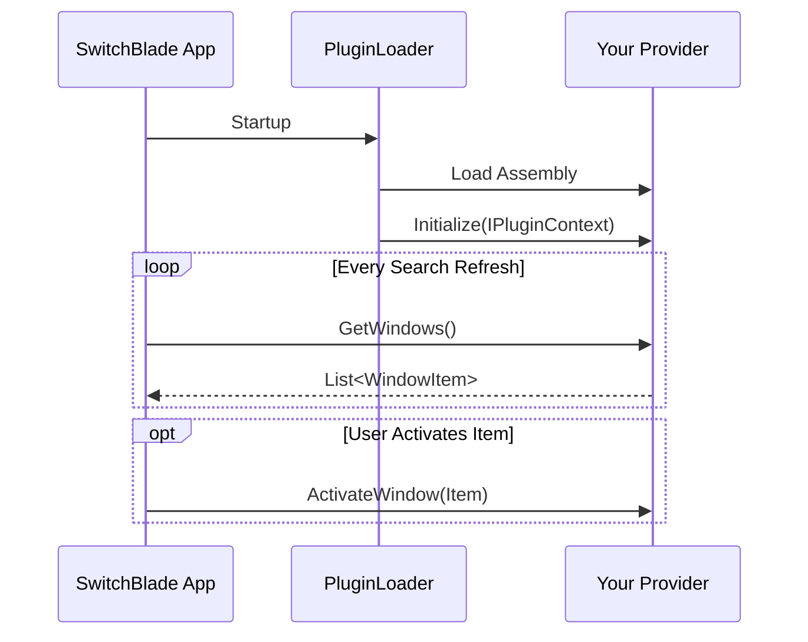
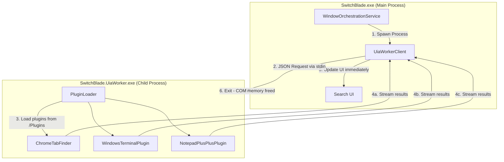
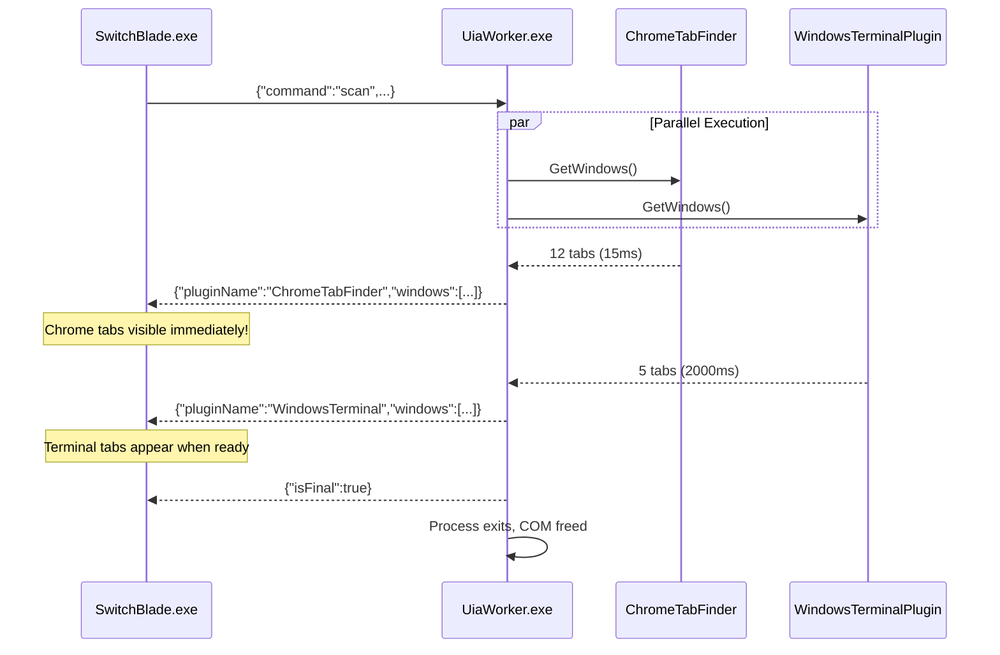
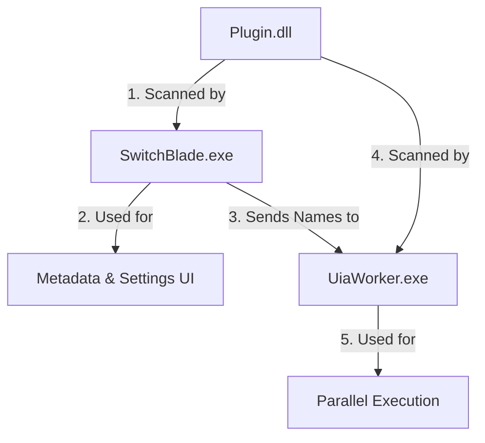
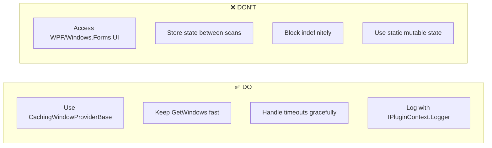

# SwitchBlade Plugin Development Guide

This guide explains how to extend **SwitchBlade** by creating custom plugins. SwitchBlade's plugin architecture allows you to add search results from any source—whether it's browser tabs, specific application windows, or even cloud resources—by implementing a simple interface.

## Prerequisites

- **Visual Studio 2022** or **VS Code**
- **.NET 9.0 SDK** (Core application target)
- Access to **SwitchBlade.Contracts.dll** (found in the SwitchBlade build directory)

---

## The Core Concept

A SwitchBlade plugin is simply a .NET Main Library (`.dll`) that contains one or more classes implementing the `IWindowProvider` interface.



### The Interface

The contract is defined in `SwitchBlade.Contracts.dll`:

```csharp
namespace SwitchBlade.Contracts
{
    public interface IWindowProvider
    {
        // 0. Metadata
        string PluginName { get; }
        bool HasSettings { get; }
        
        // 0b. Capability Flags (New in 1.8.0)
        // Set to true if your plugin uses System.Windows.Automation.
        // UIA plugins run in a separate process to prevent memory leaks.
        // Default: false
        bool IsUiaProvider { get; } 
    }
}
```

### UIA vs. Non-UIA Execution (v1.8.0+)

SwitchBlade 1.8.0 introduced a dual-process architecture to solve persistent memory leaks in the Windows UI Automation (UIA) framework.

| Mode | `IsUiaProvider` | Execution Location | Best For |
| :--- | :--- | :--- | :--- |
| **In-Process** | `false` (Default) | `SwitchBlade.exe` | Win32, Performance, Simple windows |
| **Out-of-Process** | `true` | `SwitchBlade.UiaWorker.exe` | Tab discovery, Web content, UIA-heavy logic |

---

## UIA Worker Deep Dive

### Why Out-of-Process?

Windows 11's UIA framework has a significant native memory leak when using `AutomationElement.FindAll`. This memory is never released by the Garbage Collector or thread termination even when isolated. By running UIA code in a transient worker process that exits after every scan, SwitchBlade guarantees that the OS reclaims all leaked COM memory.

### Architecture Diagram



### Streaming Protocol (v1.8.2+)

UIA plugins now run **in parallel** inside the worker, and results are streamed via **NDJSON** (Newline-Delimited JSON) as each plugin completes:



> [!TIP]
> **User Experience Impact**: Fast plugins (Chrome: ~15ms) display results almost instantly, even if slow plugins (Terminal: ~2s) are still running.

### Timeout Configuration (v1.8.1+)

The UIA Worker has a configurable timeout to prevent stuck plugins from blocking refreshes:

| Setting | Location | Default | Description |
|---------|----------|---------|-------------|
| `UiaWorkerTimeoutMs` | Registry: `HKCU\Software\SwitchBlade` | `60000` (60s) | Maximum time before worker is killed |

**What happens on timeout:**
1. Any results already streamed are preserved
2. Worker process is forcefully terminated
3. Refresh cycle completes, allowing next poll to run fresh

### Impact on Plugin Authors

If your plugin has `IsUiaProvider = true`:

1. **Execution Location**: Your plugin DLL is loaded into `SwitchBlade.UiaWorker.exe`, NOT the main app
2. **No GUI Access**: The worker process has no window; it only performs scans and returns results via JSON
3. **Self-Contained**: Your code should be stateless for the duration of `GetWindows()`
4. **Logging**: `IPluginContext.Logger` appends to `%TEMP%\switchblade_uia_debug.log` (only if launched with `/debug`). Use the dashed separator to find your session.
5. **Parallel Execution**: Your `GetWindows()` may run concurrently with other UIA plugins
6. **Thread Safety**: Use `CachingWindowProviderBase` or your own locking if needed

### The Dual Loading Model

One of the most common questions is: *"If the worker runs my plugin, does the main app still see it?"*

**Yes.** SwitchBlade uses a dual-loading approach:

1.  **Discovery (Main App)**: At startup, `SwitchBlade.exe` scans the `Plugins/` folder and loads **all** DLLs. It instantiates your class to read `PluginName`, `IsUiaProvider`, and `SettingsControl`. This is why your plugin still appears in the Settings UI and can be enabled/disabled.
2.  **Execution (Worker)**: When a scan begins, the main app sends a list of enabled UIA plugins to `SwitchBlade.UiaWorker.exe`. The worker then scans the **same** `Plugins/` folder, loads the required DLLs, and executes their `GetWindows()` methods.



**What this means for you:**
-   **Drop-in Deploy**: You still just drop your DLL into the `Plugins/` folder.
-   **Full Control**: The main app handles Enable/Disable logic perfectly.
-   **Settings Visibility**: Your settings UI always runs in the main app (so WPF works fine).
-   **Execution Isolation**: Only the heavy UIA logic runs in the worker.

---

        // Return a settings control provider or null if no settings UI.
        ISettingsControl? SettingsControl => null;

        // 2. Initialization: Receive context with logger and other dependencies
        void Initialize(IPluginContext context);

        // 3. Settings Management
        void ReloadSettings();

        // 4. Dynamic Exclusions
        // Return processes (names without extension) that this plugin handles exclusively.
        // The core WindowFinder will ignore these processes to prevent duplicates.
        IEnumerable<string> GetHandledProcesses();
        
        // Set exclusions (called by MainViewModel for all providers)
        void SetExclusions(IEnumerable<string> exclusions) { } // Default no-op

        // 5. Refresh: Return a list of items to display in the user's search
        IEnumerable<WindowItem> GetWindows();

        // 6. Activation: Handle what happens when the user presses Enter on your item
        void ActivateWindow(WindowItem item);
    }
    
    // Settings UI interface (Required in 1.6.6+ for plugins with HasSettings=true)
    public interface ISettingsControl
    {
        object CreateSettingsControl();  // Returns a WPF FrameworkElement
        void SaveSettings();
        void CancelSettings();
    }
    
    // Context object passed to Initialize()
    public interface IPluginContext
    {
        ILogger Logger { get; }
    }
}
```

### The Data Object

Your provider returns `WindowItem` objects:

```csharp
public class WindowItem
{
    public IntPtr Hwnd { get; set; }            // Window Handle (if applicable, else IntPtr.Zero)
    public string Title { get; set; }           // Text shown in search
    public string ProcessName { get; set; }     // Subtitle / category app name
    public string? ExecutablePath { get; set; } // Full path to exe (enables icon display)
    public IWindowProvider? Source { get; set; } // ALWAYS set this to 'this'
    
    // ... other properties (Icon is populated automatically by IconService)
}
```

> [!TIP]
> **Icon Display**: To display application icons for your plugin's items, populate the `ExecutablePath` property with the full path to the executable (e.g., `C:\Program Files\MyApp\app.exe`). Use `NativeInterop.GetProcessInfo(pid)` which returns both the process name and executable path in one efficient call.

---

## Step-by-Step Implementation Guide

### 1. Create a Project
Create a new **Class Library** project targeting **.NET 9.0-windows**.
```bash
dotnet new classlib -n MyCustomPlugin -f net9.0-windows
```

### 2. Add References
Reference the `SwitchBlade.Contracts.dll`. You can copy this DLL from the SwitchBlade main output directory.

### 3. Implement the Provider
Here is a complete, minimal example:

```csharp
using SwitchBlade.Contracts;
using System;
using System.Collections.Generic;

namespace MyCustomPlugin
{
    public class SimpleProvider : IWindowProvider
    {
        private ILogger? _logger;
        
        public string PluginName => "SimpleDemo";
        public bool HasSettings => false;

        public void Initialize(IPluginContext context)
        {
            // Store the logger for diagnostic output
            _logger = context.Logger;
            _logger?.Log("SimpleDemo plugin initialized");
        }

        public void ReloadSettings() { /* Nothing to reload */ }

        public IEnumerable<WindowItem> GetWindows()
        {
            // Return dummy items, file results, or API data
            yield return new WindowItem
            {
                Title = "My Plugin Result",
                ProcessName = "PluginDemo",
                Source = this // Critical for activation callback
            };
        }

        public void ActivateWindow(WindowItem item)
        {
            // Logic to execute when selected
            _logger?.Log($"Activating: {item.Title}");
            System.Diagnostics.Process.Start("notepad.exe");
        }
    }
}
```

---

## Case Study: ChromeTabFinder

The `ChromeTabFinder` demonstrates advanced usage, including custom settings storage and concurrency-safe scanning via `CachingWindowProviderBase`.

#### 1. Class Definition
It inherits from `CachingWindowProviderBase` to get automatic concurrency protection:

```csharp
public class ChromeTabFinder : CachingWindowProviderBase
{
    public override string PluginName => "ChromeTabFinder";
    public override bool HasSettings => true;
    // ...
}
```

#### 2. Configuration
It uses `PluginSettingsService` (which implements `IPluginSettingsService`) to store settings in the Registry under `HKCU\Software\SwitchBlade\Plugins\ChromeTabFinder`.

```csharp
public override void ReloadSettings()
{
    // Load process list from registry...
}
```

#### 3. Scanning Windows (ScanWindowsCore)
It overrides `ScanWindowsCore()` (not `GetWindows()`) to perform the actual scan. The base class handles concurrency:

```csharp
protected override IEnumerable<WindowItem> ScanWindowsCore()
{
    // Find browser processes, then use UIAutomation (TreeWalker)
    // to discover tab controls. This method is only called when
    // no other scan is in progress.
    return results;
}
```

#### 4. Activation
When a user selects a specific *tab*, the provider handles the specifics:

```csharp
public override void ActivateWindow(WindowItem item)
{
    // 1. Bring the main Chrome window to front first
    // Use the shared NativeInterop from SwitchBlade.Contracts
    NativeInterop.ForceForegroundWindow(item.Hwnd);
    
    // 2. Use UIAutomation to find the specific tab control again
    // ... Select tab pattern ...
}
```

## Case Study: Microsoft Teams Plugin

The `TeamsPlugin` demonstrates how to handle robust activation when standard patterns fail, and how to parse metadata from UI naming conventions.

#### 1. Surgical BFS Discovery
Instead of scanning the entire window (which is huge in Chromium apps), we use a targeted Breadth-First Search (BFS) to find `TreeItem` controls quickly.

```csharp
// Surgical BFS: Only look for TreeItems, stop at dead ends
if (controlType == ControlType.TreeItem) { ... }
if (controlType != ControlType.Document) { queue.Enqueue(child); }
```

#### 2. Regex parsing
Teams encodes state in the accessible name: *"Chat John Doe Available"*. The plugin uses regex to extract the clean name and status.

```csharp
// "Chat (.+?) (Available|Busy|...)"
var match = IndividualChatRegex.Match(rawName);
```

#### 3. Activation Pattern Cascade
Teams items aren't always clickable. The plugin uses a **Cascading Fallback** strategy to ensure activation works:

```csharp
// Try 1: Click it
if (pattern.Invoke()) return;

// Try 2: Select it (Works for list items)
if (pattern.Select()) return;

// Try 3: Expand it (Works for tree nodes)
if (pattern.Expand()) return;

// Try 4: Focus it (Last resort)
element.SetFocus();
```

---

## Deployment

1. Build your project (`Release` mode recommended).
2. Navigate to the SwitchBlade installation directory.
3. Create a folder named `Plugins` (if it doesn't exist).
    - `SwitchBlade.exe`
    - `Plugins\`
        - `MyCustomPlugin.dll`
        - `AnotherPlugin.dll`
4. Restart SwitchBlade. The `PluginLoader` will automatically discover your DLL, find any class implementing `IWindowProvider`, and load it.

## Best Practices

- **Performance**: `GetWindows()` is called every time the search refreshes (or periodically). Keep it fast. If you are querying slow APIs, cache your results and return the cached list immediately.
- **Memory Usage**: Avoid using `System.Diagnostics.Process` if possible, as it allocates significant memory. Use `NativeInterop.GetProcessName(pid)` for lightweight process name lookups.
- **HashSet for Process Lists**: If your plugin tracks multiple target process names, use `HashSet<string>` with `StringComparer.OrdinalIgnoreCase` for O(1) lookups instead of O(n) list searches.
- **Error Handling**: Wrap your `GetWindows` logic in try/catch blocks. If your plugin throws an exception, it might be logged but won't crash the main app.
- **Dependencies**: If your plugin relies on other DLLs, ensure they are also copied to the `Plugins` folder or available in the global path.
- **Icon Support**: Always populate `ExecutablePath` using `NativeInterop.GetProcessInfo(pid)` so that SwitchBlade can display the correct application icon for your items.

### UIA Plugin Best Practices (v1.8.0+)

If your plugin sets `IsUiaProvider = true`, follow these additional guidelines:



| Guideline | Reason |
|-----------|--------|
| **Be Stateless** | Worker process exits after each scan; any state is lost |
| **Avoid Blocking Calls** | 60s timeout will kill your plugin mid-scan |
| **No UI Code** | Worker has no GUI; `MessageBox.Show` will hang |
| **Use Try-Catch** | Exceptions are caught, but your results won't appear |
| **Parallel-Safe** | Other UIA plugins run concurrently; don't share mutable statics |

> [!WARNING]
> **Timeout Behavior**: If your `GetWindows()` takes longer than the configured timeout (default 60s), the worker is killed and your results are lost. Results that were already streamed (from faster plugins) are preserved.

---

## Concurrency & Caching Best Practices

SwitchBlade may call `GetWindows()` on plugins concurrently from multiple threads (e.g., background polling, manual refreshes). If your scan takes a long time, you risk:

1. **Duplicate scans** running simultaneously, wasting resources.
2. **Stale data** from a slow scan overwriting fresh data from a faster subsequent scan.

### Recommended: Use `CachingWindowProviderBase`

The contracts assembly provides `CachingWindowProviderBase`, an abstract base class that handles concurrency automatically:

```csharp
using SwitchBlade.Contracts;

public class MySlowPlugin : CachingWindowProviderBase
{
    public override string PluginName => "MySlowPlugin";
    public override bool HasSettings => false;

    public override void ActivateWindow(WindowItem item) { /* ... */ }

    protected override IEnumerable<WindowItem> ScanWindowsCore()
    {
        // Your slow scanning logic here.
        // This method will ONLY be called if no scan is currently in progress.
        // If a scan IS in progress, GetWindows() returns cached results automatically.
        return results;
    }
}
```

**Key benefits:**
- **Automatic locking**: If `GetWindows()` is called while a scan is running, the base class returns cached results immediately.
- **`IsScanRunning` property**: Check if a scan is in progress.
- **`CachedWindows` property**: Access the cached results directly.

### Alternative: Manual Implementation

If you need custom concurrency handling, you can still implement `IWindowProvider` directly:

```csharp
public class MyCustomPlugin : IWindowProvider
{
    private readonly object _lock = new object();
    private volatile bool _isScanning = false;
    private List<WindowItem> _cache = new();

    public IEnumerable<WindowItem> GetWindows()
    {
        if (_isScanning) return _cache;

        lock (_lock)
        {
            if (_isScanning) return _cache;
            _isScanning = true;
        }

        try
        {
            _cache = DoActualScan();
            return _cache;
        }
        finally
        {
            lock (_lock) { _isScanning = false; }
        }
    }
}
```

---

## Migration Guide: v1.6.5 → v1.6.6

Version 1.6.6 **removes** the deprecated `ShowSettingsDialog(IntPtr)` method. All plugins with settings must now implement the `ISettingsControl` interface.

### Breaking Change: `ShowSettingsDialog` Removed

**Before (v1.6.5 - deprecated):**
```csharp
public bool HasSettings => true;

public void ShowSettingsDialog(IntPtr ownerHwnd)
{
    var dialog = new MySettingsWindow(ownerHwnd);
    dialog.ShowDialog();
}
```

**After (v1.6.6+):**
```csharp
public bool HasSettings => true;

// Required: Return your settings UI control provider
public ISettingsControl? SettingsControl => new MySettingsControlProvider();

// Implement ISettingsControl:
public class MySettingsControlProvider : ISettingsControl
{
    private MySettingsUserControl? _control;
    
    public object CreateSettingsControl()
    {
        _control = new MySettingsUserControl();
        return _control;
    }
    
    public void SaveSettings()
    {
        _control?.Save();
    }
    
    public void CancelSettings()
    {
        // Discard changes or restore original values
    }
}
```

### Key Changes
1. **Remove** any `ShowSettingsDialog` override from your plugin
2. **Convert** your settings `Window` to a `UserControl`
3. **Implement** `ISettingsControl` to wrap your control with save/cancel logic
4. **Return** an instance of your provider from the `SettingsControl` property

### Benefits
- **No HWND management**: The host application handles dialog creation and lifecycle
- **Consistent styling**: Your control inherits the application theme automatically
- **Easier testing**: Unit test your control in isolation without Win32 dependencies
- **Cleaner code**: No more `WindowInteropHelper` or manual parent window handling

---

## Migration Guide: v1.7.x → v1.8.0 (UIA Out-of-Process)

Version 1.8.0 introduces the **out-of-process UIA architecture**. Existing UIA plugins require minimal changes.

### Non-Breaking: Just Add `IsUiaProvider`

If your plugin uses `System.Windows.Automation`, add the flag to opt into out-of-process execution:

```csharp
// Before (v1.7.x) - runs in-process, may leak memory
public class MyUiaPlugin : IWindowProvider
{
    public string PluginName => "MyUiaPlugin";
    // ... no IsUiaProvider property
}

// After (v1.8.0+) - runs in SwitchBlade.UiaWorker.exe
public class MyUiaPlugin : IWindowProvider
{
    public string PluginName => "MyUiaPlugin";
    public bool IsUiaProvider => true;  // NEW: Enable out-of-process execution
    // ...
}
```

### Key Behavioral Changes

| Before (v1.7.x) | After (v1.8.0+) |
|-----------------|-----------------|
| Runs in `SwitchBlade.exe` | Runs in `SwitchBlade.UiaWorker.exe` |
| Memory leaks accumulate | Process exits after scan, memory freed |
| Plugin state persists | Plugin is re-instantiated each scan |
| No timeout protection | 60s configurable timeout |
| Sequential execution | Parallel execution with streaming (v1.8.2) |

### Required Code Changes

1. **Remove Static State**: Any `static` mutable fields will not persist between scans
2. **Remove UI Code**: No `MessageBox`, `Window`, or WPF elements (worker has no GUI)
3. **Add Timeout Handling**: If your scan can be slow, consider caching or pagination

> [!IMPORTANT]
> If your plugin does NOT use `System.Windows.Automation`, you do NOT need to set `IsUiaProvider`. Keep it `false` (or omit it) for best performance.

---

## Migration Guide: v1.4.1 → v1.4.2

Version 1.4.2 introduces **breaking changes** to the plugin API. Follow this guide to update your plugins.

### Breaking Change: `Initialize()` Signature

**Before (v1.4.1):**
```csharp
public void Initialize(object settingsService, ILogger logger)
{
    _logger = logger;
    // settingsService was passed but rarely used by plugins
}
```

**After (v1.4.2):**
```csharp
public void Initialize(IPluginContext context)
{
    _logger = context.Logger;
    // Context object is cleaner and extensible
}
```

### Using `CachingWindowProviderBase`

If you're using `CachingWindowProviderBase`, the change is similar:

```csharp
// Before
public override void Initialize(object settingsService, ILogger logger)
{
    base.Initialize(settingsService, logger);
    _logger = logger;
}

// After
public override void Initialize(IPluginContext context)
{
    base.Initialize(context);
    _logger = context.Logger;
}
```

### New: `NativeInterop` Shared Library

Version 1.4.2 consolidates P/Invoke declarations in `SwitchBlade.Contracts.NativeInterop`. Instead of defining your own:

```csharp
// Before: Local NativeMethods class with duplicate P/Invoke declarations
NativeMethods.ForceForegroundWindow(hwnd);

// After: Use shared library from Contracts
using SwitchBlade.Contracts;
NativeInterop.ForceForegroundWindow(hwnd);
```

Available methods include:
- `EnumWindows()`, `IsWindowVisible()`, `GetWindowThreadProcessId()`
- `GetWindowText(hwnd, span, maxCount)` - now uses `Span<char>` for zero-allocation
- `GetProcessName(pid)` - lightweight process name lookup (avoids `Process` allocation)
- `GetProcessInfo(pid)` - returns `(string ProcessName, string? ExecutablePath)` tuple for icon support
- `ForceForegroundWindow()` - robust focus stealing with thread attachment
- `ShowWindow()`, `BringWindowToTop()`, `SetForegroundWindow()`
- `IsIconic()`, `GetForegroundWindow()`

### New: `SetExclusions()` Interface Method

The `IWindowProvider` interface now includes a default method for setting exclusions:

```csharp
// Default implementation is no-op
void SetExclusions(IEnumerable<string> exclusions) { }
```

Override this if your plugin needs to filter out processes handled by other plugins.

### New: `IPluginSettingsService` Interface

For better testability, `PluginSettingsService` now implements `IPluginSettingsService`.
If you are writing unit tests for your plugin, you can now inject a mock `IPluginSettingsService` instead of relying on the real Registry.

```csharp
// Production usage (default constructor)
_settings = new PluginSettingsService(PluginName);

// Test usage (inject interface)
public MyPlugin(IPluginSettingsService settings) { _settings = settings; }
```

---

## Version History

| Version | Key Changes |
|---------|-------------|
| 1.8.2   | **Streaming UIA Results** - Plugins run in parallel, results streamed via NDJSON for faster UI updates |
| 1.8.1   | **UIA Worker Timeout** - Configurable timeout (default 60s) to prevent stuck plugins from blocking refreshes |
| 1.8.0   | **Out-of-Process UIA** - `IsUiaProvider` flag, UIA plugins run in transient worker process to fix memory leaks |
| 1.6.6   | **BREAKING**: `ShowSettingsDialog` removed. All plugins must use `ISettingsControl` for settings UI |
| 1.6.5   | **ISettingsControl** - New interface for WPF-based plugin settings UI, `ShowSettingsDialog` deprecated |
| 1.5.8   | **Performance & Icons** - `ExecutablePath` on `WindowItem`, `LibraryImport` migration, zero-allocation `Span<char>` interop |
| 1.5.6   | **Performance** - Native `EnumWindows` for Notepad++, `HashSet<string>` O(1) lookups, `ReaderWriterLockSlim` in caching base class |
| 1.4.15  | **Notepad++ Plugin** - Lists individual tabs from Notepad++ instances using UI Automation |
| 1.4.9   | **Windows Terminal Plugin** - Lists individual tabs from Terminal instances using UI Automation |
| 1.4.6   | Removed `SwitchBlade.Core.Interop`, fully migrated to `SwitchBlade.Contracts.NativeInterop` |
| 1.4.2   | `IPluginContext`, `NativeInterop`, `IPluginSettingsService` |
| 1.4.1   | `CachingWindowProviderBase`, concurrency protection |
| 1.4.0   | Plugin settings, number shortcuts |
| 1.3.0   | Initial plugin framework |

