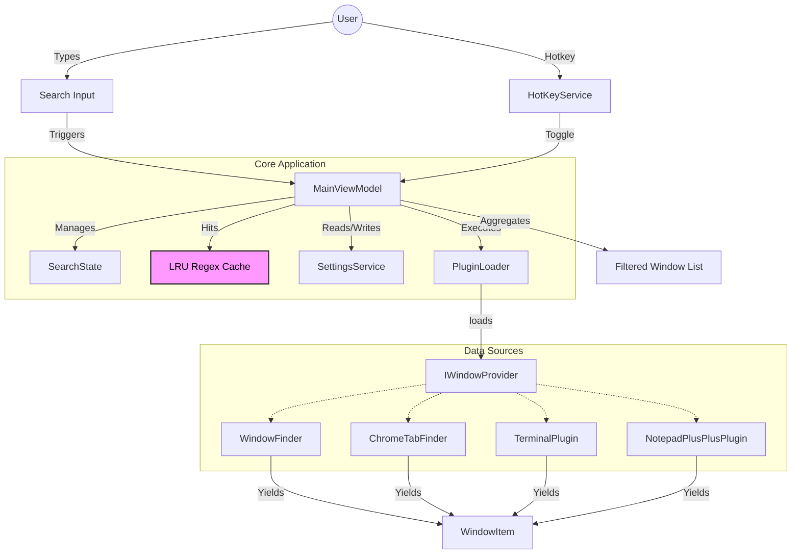
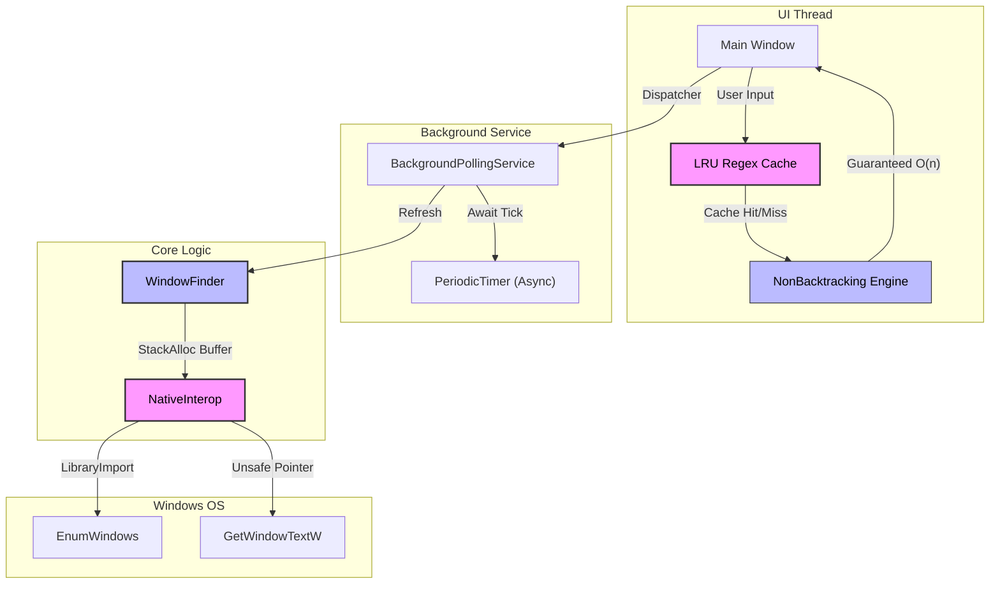
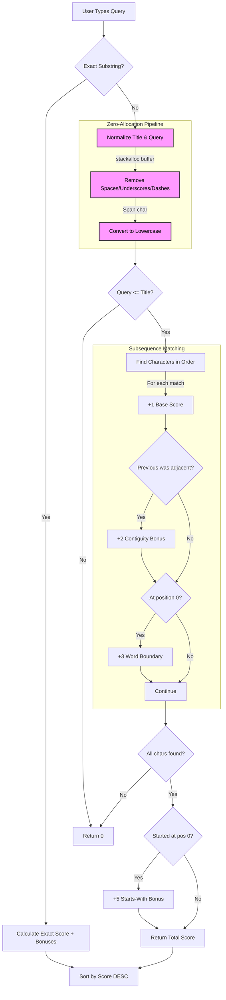
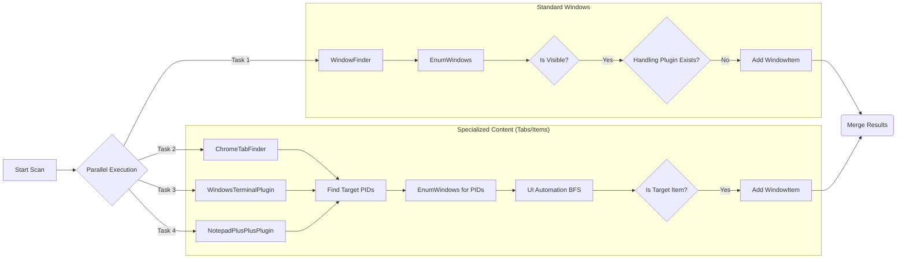
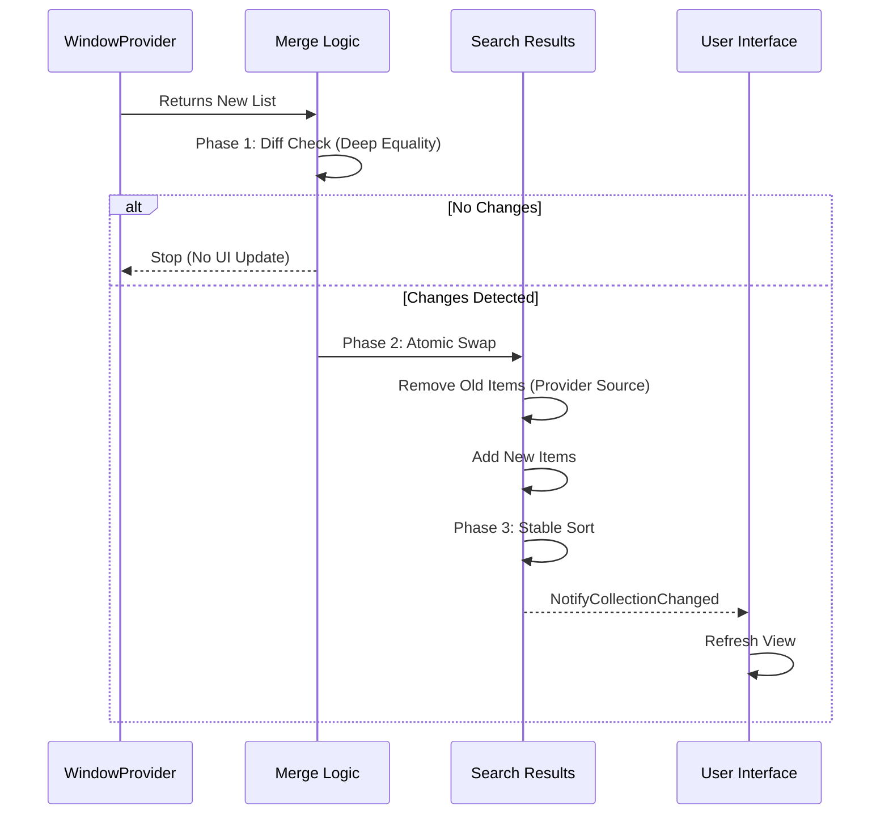
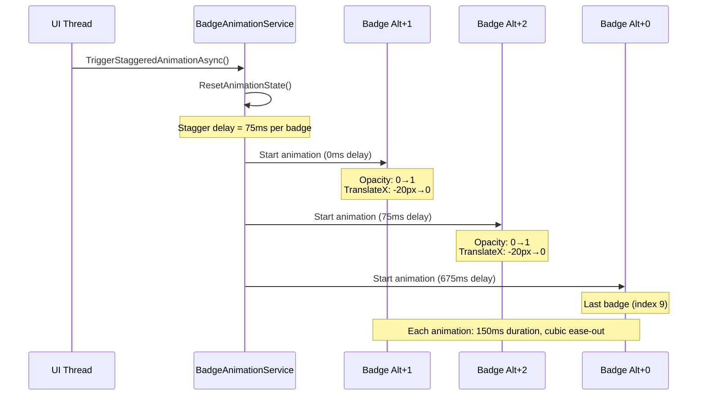

# SwitchBlade Technical Documentation

**Current Version: 1.6.1** | [View Changelog](CHANGELOG.md)

## Overview
SwitchBlade is a high-performance Keyboard-Driven Window Switcher for Windows. It is built using **C# / WPF** and follows the **MVVM (Model-View-ViewModel)** architectural pattern. It is designed to be extensible via a robust Plugin System, allowing it to index not just top-level windows but also internal document tabs as searchable items.

The package comes with several specialized plugins out of the box:
- **Window Finder**: Discovers all standard top-level desktop application windows.
- **Chrome Tab Finder**: Indexes individual tabs from Google Chrome, Microsoft Edge, and other Chromium-based browsers.
- **Windows Terminal**: Discovers and allows switching between multiple tabs within Windows Terminal instances.
- **Notepad++**: Indexes and switches between individual open files/tabs in Notepad++.


## Basic Usage

- **Toggle SwitchBlade**: Press `Ctrl + Shift + Q` (Default) to show or hide the search window.
- **Search**: Start typing immediately to filter open windows and tabs.
- **Navigate**: Use `Up` / `Down` arrows to select a window.
- **Activate**: Press `Enter` to switch to the selected window.
- **Close**: Press `Escape` to hide SwitchBlade without switching.

## Keyboard Shortcuts

SwitchBlade supports the following keyboard shortcuts for navigation:

| Key | Action |
| :--- | :--- |
| `↑` / `↓` | Move selection up/down by one item |
| `Page Up` / `Page Down` | Move selection up/down by one visible page |
| `Ctrl+Home` | Jump to the first item |
| `Ctrl+End` | Jump to the last item |
| `Enter` | Activate the selected window |
| `Escape` | Hide the SwitchBlade window |
| `Alt+1` to `Alt+0` | Quick-switch to windows 1-10 (configurable modifier) |

## Architecture

### Core Components
- **MainViewModel**: The central brain of the application. It orchestrates window provider execution, aggregates results, and manages the search/filter state.
- **Service Layer**: 
  - `SettingsService`: Manages persistence of user preferences (Registry-based).
  - `HotKeyService`: Handles global low-level keyboard hooks for the toggle hotkey.
- **Window Providers**: Independent modules responsible for scanning and returning `WindowItem` objects.



## Performance

SwitchBlade 1.5.1+ utilizes bleeding-edge .NET 9 features to ensure minimal resource footprint and maximum responsiveness.

### Key Optimizations
- **Zero-Allocation Window Scanning**: Uses `Span<char>`, `stackalloc` and `Unsafe` pointers to retrieve window titles and binary paths without generating garbage (GC pressure).
- **Source-Generated Interop**: Replaces slow `[DllImport]` with high-performance `[LibraryImport]` for all Windows API calls, ensuring trimming and AOT compatibility.
- **Modern Async Polling**: Uses `PeriodicTimer` for lock-free, efficient background updates.
- **Smart Caching**: Process names, paths, and icons come from a concurrent cache to minimize kernel transitions and I/O.
- **Configurable Regex caching**: Implements an LRU (Least Recently Used) cache for compiled regex objects to ensure buttery-smooth search responsiveness during rapid typing.
- **Immune to ReDoS**: Dynamically switches to the `.NET 9 NonBacktracking` engine for all user-provided patterns, providing guaranteed linear-time matching and protection against malicious regex hangs.
- **ReadyToRun (R2R) Deployment**: Pre-compiled native code in the binary reduces startup time and eliminates JIT warm-up latency.



## Fuzzy Search

SwitchBlade 1.6.0 introduces intelligent fuzzy search that makes finding windows effortless.

### Features

| Feature | Description | Example |
|:--------|:------------|:--------|
| **Delimiter Equivalence** | Spaces, underscores, and dashes are treated identically | `hello there` matches `hello_there` |
| **Subsequence Matching** | Characters must appear in order but not consecutively | `gc` matches `Google Chrome` |
| **Case Insensitive** | Matching ignores letter case | `CHROME` matches `chrome` |
| **Relevance Sorting** | Best matches appear first based on scoring | Exact matches rank highest |

### Scoring System

Fuzzy search ranks results using a weighted scoring algorithm:

| Bonus | Points | Awarded When |
|:------|:------:|:-------------|
| Base Match | +1 | Each matched character |
| Contiguity | +2 | Consecutive character matches |
| Word Boundary | +3 | Match at start of title |
| Starts-With | +5 | Title begins with query |



### Configuration

- **Enable/Disable**: Toggle in Settings → Search & Performance → "Enable Fuzzy Search"
- **Default**: Enabled
- **Fallback**: When disabled, uses legacy regex/substring matching

## Development

For information on how to build the project and create plugins, please refer to the following guides:

- [Build Instructions](BUILD.md): Detailed steps for setting up your environment, building SwitchBlade, and running unit tests.
- [Plugin Development Guide](PLUGIN_DEVELOPMENT.md): A comprehensive guide on building custom plugins for window discovery.
- [Build Instructions](BUILD.md): Detailed steps for setting up your environment, building SwitchBlade, and running unit tests.
- [Plugin Development Guide](PLUGIN_DEVELOPMENT.md): A comprehensive guide on building custom plugins for window discovery.

### Unit Tests
The project includes comprehensive xUnit tests in `SwitchBlade.Tests/`. Run tests with:
```powershell
dotnet test SwitchBlade.Tests/SwitchBlade.Tests.csproj
```

### Plugin System
SwitchBlade uses a contract-based plugin architecture.
- **Interface**: `SwitchBlade.Contracts.IWindowProvider`
- **Mechanism**: On startup, `PluginLoader` scans the `Plugins` directory for DLLs implementing `IWindowProvider`.
- **Isolation**: Each plugin runs within the main application process but is logically isolated by the `WindowItem` source property.

## Command-Line Arguments

SwitchBlade supports the following command-line parameters (prefixes `/`, `--`, or `-` are all supported):

| Parameter | Description |
| :--- | :--- |
| `/debug` | Enables verbose logging. Logs are saved to `%TEMP%\switchblade_debug.log`. |
| `/minimized` | Starts the application in the system tray without showing the main window. |
| `/enablestartup` | Used by the installer to enable "Launch on Startup" in the Windows Registry on first run. |

## Window Discovery Logic



### 1. Core Window Finder (`WindowFinder.cs`)
This is the built-in provider for standard desktop applications.
- **Method**: Uses the Win32 `EnumWindows` API to iterate over all top-level windows on the desktop.
- **Filtering**:
  - Checks `IsWindowVisible`.
  - Filters out known system noise (e.g., "Program Manager").
  - **Zero-Allocation Process Lookup**: Uses specialized native APIs (`QueryFullProcessImageName`) instead of the heavy .NET `Process` class to identify window owners without allocating managed memory.
  - **Smart De-Duplication**: It automatically inspects the `IBrowserSettingsProvider` list. If a window belongs to a process that is handled by a specialized plugin (e.g., "chrome", "comet"), `WindowFinder` **excludes** it. This prevents double-entries where both the generic window title and the specific tabs would appear.

### 2. Chrome Tab Finder (`ChromeTabFinder.cs`)
A specialized plugin for Chromium-based browsers (Chrome, Edge, Brave, Comet, etc.).
- **Discovery Strategy**:
  1.  **Process Identification**: Identifies target processes by name (configurable).
  2.  **Window Enumeration**: Uses `EnumWindows` (Win32) to find **ALL** top-level windows belonging to those PIDs. This is critical for supporting multi-window setups, as `Process.MainWindowHandle` often misses secondary windows.
  3.  **UI Automation**: Attaches to each window using `System.Windows.Automation`.
  4.  **Tree Traversal (`FindTabsBFS`)**: Performs a Breadth-First Search (BFS) of the automation tree to find elements with `ControlType.TabItem`.

#### Performance Optimization
- **Document Pruning**: The scanner explicitly skips traversing into `ControlType.Document` nodes. This effectively ignores the millions of DOM elements inside the web page content, focusing the scan solely on the browser's UI "chrome". This reduces scan time from seconds to milliseconds.
- **Depth Limiting**: Traversal is capped at a depth of 20 to prevent infinite recursion in complex UI trees.

#### Thread Safety
- **Logging**: Debug logging to `%TEMP%` is protected by a static `lock` object to prevent write contention during parallel scans.

### 3. Windows Terminal Plugin (`WindowsTerminalPlugin.cs`)
A specialized plugin for Microsoft's Windows Terminal.
- **Discovery Strategy**:
  1.  **Process Identification**: Identifies target processes by name (default: "WindowsTerminal", configurable via settings).
  2.  **UI Automation**: Attaches to the main window handle (`MainWindowHandle`) of each identified process.
  3.  **Tree Traversal (`ScanForTabs`)**: Performs a Breadth-First Search (BFS) of the automation tree up to a depth of 12 to find `ControlType.TabItem` elements.
- **Fallback Mechanism**: If no tabs are discovered (often due to elevation/UIPI restrictions when SwitchBlade is not elevated), the plugin returns the main terminal window as a single searchable item.
- **Activation**:
  1.  Brings the main window to the foreground.
  2.  Uses UI Automation patterns (`SelectionItemPattern` or `InvokePattern`) to programmatically select the specific tab requested by the user.

### 4. Notepad++ Plugin (`NotepadPlusPlusPlugin.cs`)
Indexes and switches between individual open files/tabs in Notepad++.
- **Mechanism**: Similar to the Terminal plugin, it uses UI Automation to traverse the document tabs in Notepad++.
- **Strategy**: Identifies `notepad++` processes and scans for tab items to allow direct file-level switching.

## Async & Threading Model

### Parallel Execution
SwitchBlade does NOT block the UI thread while searching.
- When `RefreshWindows()` is called, the application spawns a separate `Task` for each loaded `IWindowProvider`.
- These tasks run in parallel on the ThreadPool. The fast `WindowFinder` typically finishes in <10ms, while `ChromeTabFinder` may take 100-300ms depending on open tabs.

### UI Marshalling
- As each background task completes, it marshals its results back to the UI thread using `Application.Current.Dispatcher.Invoke`.
- This creates a "Pop-in" effect where core windows appear instantly, followed shortly by browser tabs.

## Smart Refresh & List Merge Strategy

SwitchBlade uses a sophisticated incremental update strategy to keep the window list stable and prevent visual disruption during updates. The goal is to never clear the list and re-add all items, which would cause flickering and loss of user context.

### Persistence Strategy
1. **No Clear-On-Toggle**: When the Global Hotkey is pressed, the list is **NOT** cleared. The user immediately sees the results from the *previous* session while background scans run.
2. **Provider-Isolated Updates**: Each window provider (e.g., `WindowFinder`, `ChromeTabFinder`) updates its own slice of the list independently. Changes from one provider don't affect items from other providers.

### Incremental Merge Algorithm



When a provider completes scanning, the merge happens in three phases:

#### Phase 1: Diff Check (Optimization)
Before modifying the list, we check if anything actually changed:
```
1. Count check: If existingItems.Count != newItems.Count, skip to Phase 2
2. Deep equality: Compare (Hwnd, Title) tuples of existing vs new items
3. If collections are identical → skip update entirely (no UI refresh)
```
This prevents unnecessary UI churn when background polling finds no changes.

#### Phase 2: Atomic Remove + Add
If changes are detected:
```
1. Remove all items where item.Source == currentProvider (iterating backwards)
2. Add all new items from this provider
3. Trigger UpdateSearch() to re-sort and refresh FilteredWindows
```
This is an atomic swap that ensures we never have a partially-updated state.

#### Phase 3: Stable Sort
After merging, items are sorted using a deterministic 3-key sort:
```
OrderBy(ProcessName) → ThenBy(Title) → ThenBy(Hwnd)
```
This ensures:
- Items from the same application are grouped together
- Within an application, items are alphabetically ordered
- The sort is fully deterministic (using Hwnd as tiebreaker)

### Selection Preservation

During list updates, the selection behavior is controlled by the **List Refresh Behavior** setting:

| Setting | Behavior |
| :--- | :--- |
| **Preserve scroll position** (default) | Selection is updated silently. The scroll position stays exactly where it was. The view does NOT auto-scroll to the selected item. |
| **Follow selected window (Identity)** | Selection follows the same **window identity** (Hwnd + Title). If your selected window moves, the list auto-scrolls to keep it visible. |
| **Keep selection index (Position)** | Selection stays at the current **index position**. If you're viewing item #3, you'll still be viewing item #3 after refresh (even if the window at that position changed). The list auto-scrolls to the new selection. |

### Diff Key Design

Chrome tabs share the same `Hwnd` (the browser window handle), so we use a composite key:
```
Identity = (Hwnd, Title)
```
This allows us to:
- Distinguish between tabs in the same browser window
- Detect when a tab's title has changed (e.g., page navigation)
- Properly track selection across refreshes

### Thread Safety

The merge operation runs on background threads via `Task.Run()`, but all mutations to `_allWindows` and `FilteredWindows` are marshalled to the UI thread via `Dispatcher.Invoke()`. This ensures:
- No race conditions on the ObservableCollection
- WPF bindings receive proper change notifications
- The UI remains responsive during long scans

## Run as Administrator

Some plugins require elevated privileges to fully inspect certain windows (e.g., tabs in an elevated Terminal or other admin-level applications).

### Configuration
- **Toggle**: Found in Settings → "Run as Administrator"
- **Default**: Off (disabled)
- **Effect**: When enabled, SwitchBlade displays a UAC prompt on startup

### Behavior
When the setting is toggled:
1. The setting is saved immediately
2. A dialog prompts the user to restart
3. On next startup, SwitchBlade requests elevation via UAC

> **Note**: If "Launch on Windows Startup" is also enabled, and the user wants automatic elevation, they may need to configure a Scheduled Task with "Run with highest privileges" instead of the standard Run registry entry.

## Background Polling

SwitchBlade supports optional background polling to keep the window list up-to-date even when the application is not in focus.

### Configuration
- **Enable Background Polling**: Toggle in Settings (default: enabled).
- **Polling Interval**: Configurable in Settings (default: 30 seconds, range: 5-120 seconds).

### Concurrency Protection
The `BackgroundPollingService` uses a `SemaphoreSlim(1, 1)` to ensure only one refresh operation runs at a time. If a refresh is already in progress when the timer ticks, that tick is skipped. This prevents thread contention and race conditions on the window list.

## Number Shortcuts

SwitchBlade supports number shortcuts for instant window switching. When enabled, holding the modifier key and pressing a number key (1-9 or 0) will immediately activate the corresponding window in the list.

### Key Mapping
| Keys | Window Position |
| :---: | :---: |
| `Alt+1` | 1st window |
| `Alt+2` | 2nd window |
| ... | ... |
| `Alt+9` | 9th window |
| `Alt+0` | 10th window |

### Configuration
- **Enable Number Shortcuts**: Toggle in Settings (default: enabled)
- **Shortcut Modifier**: Choose Alt, Ctrl, Shift, or None (default: Alt)
- Supports both main keyboard number row and NumPad keys
- When enabled, number badges appear next to the first 10 windows in the list

### Smooth Reordering
The window list maintains a stable sort (by Process Name → Title → Handle) to minimize visual disruption when new windows appear. Combined with the incremental merge strategy, the numbered positions update smoothly without full list refreshes.

### Badge Animation System

The Alt+Number badges feature a staggered animation that provides visual polish when the window list appears. Each badge fades in and slides from left to right in sequence.



#### Animation Timing
| Parameter | Value | Purpose |
|:---|:---|:---|
| **Stagger Delay** | 75ms | Time between each badge starting its animation |
| **Duration** | 150ms | Total animation time per badge |
| **Offset** | -20px | Starting X position (slides right to 0) |
| **Easing** | Cubic ease-out | Smooth deceleration |

#### HWND Tracking
The `BadgeAnimationService` tracks which window handles (HWNDs) have been animated to prevent re-animation:
- When a window's title changes but HWND remains the same → badge stays visible (no re-animation)
- When search text changes → animation state resets, badges re-animate with filtered results
- When window hides and shows again → full reset, all badges animate fresh

#### Configuration
- **Enable Badge Animations**: Toggle in Settings (default: enabled)
- When disabled, badges appear instantly at full opacity
