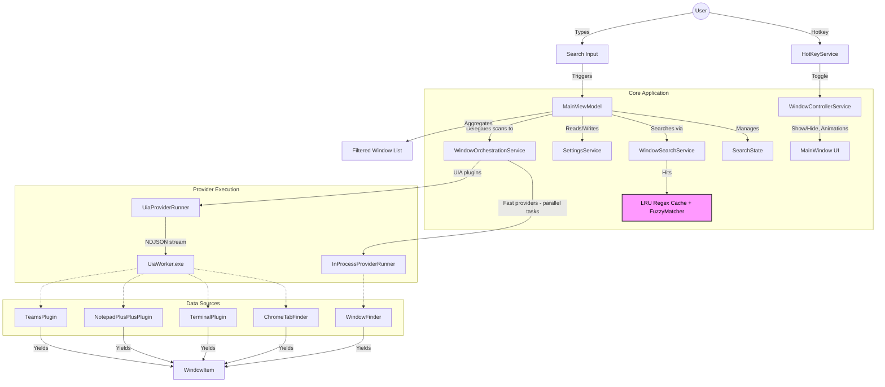
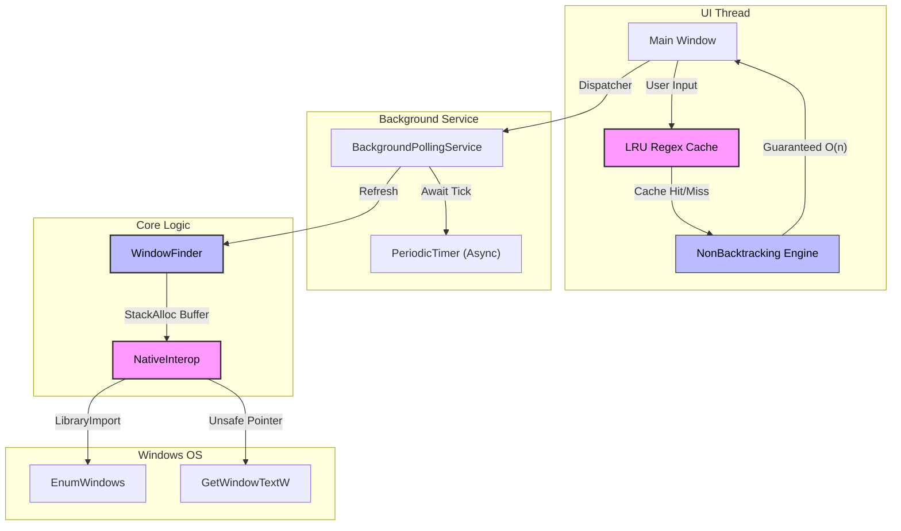
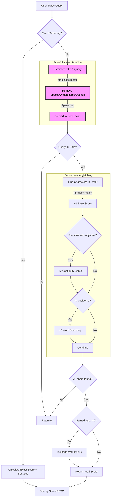
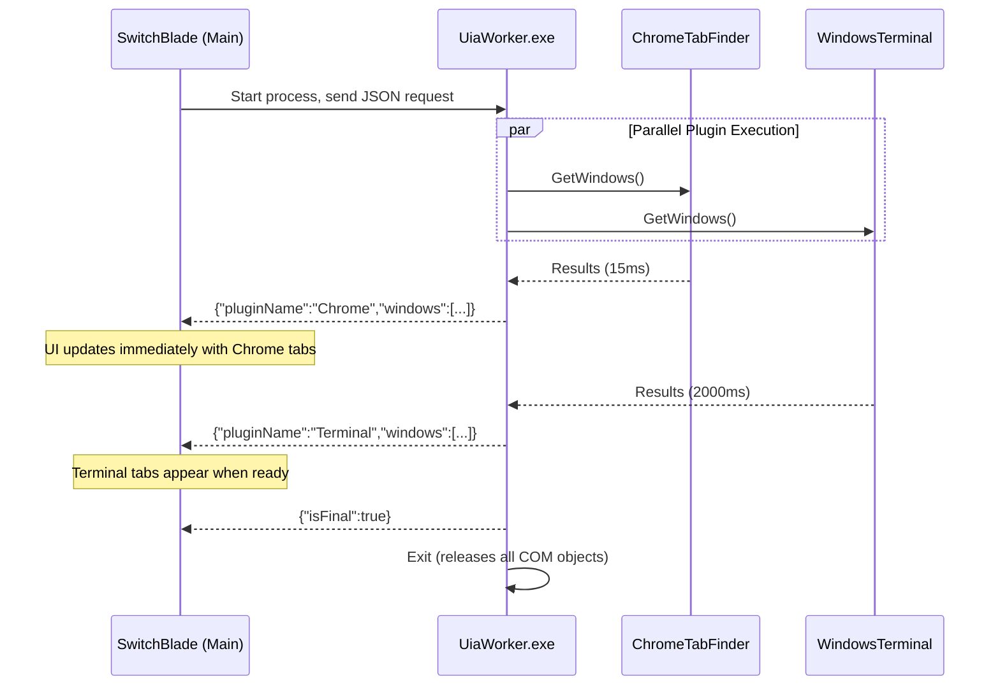
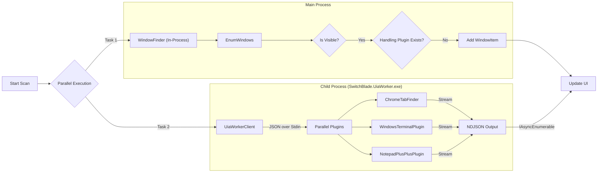
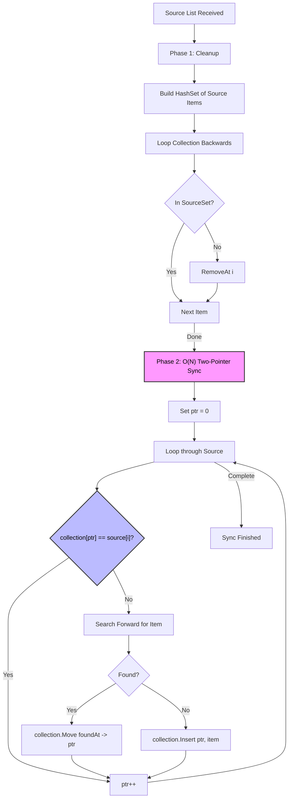
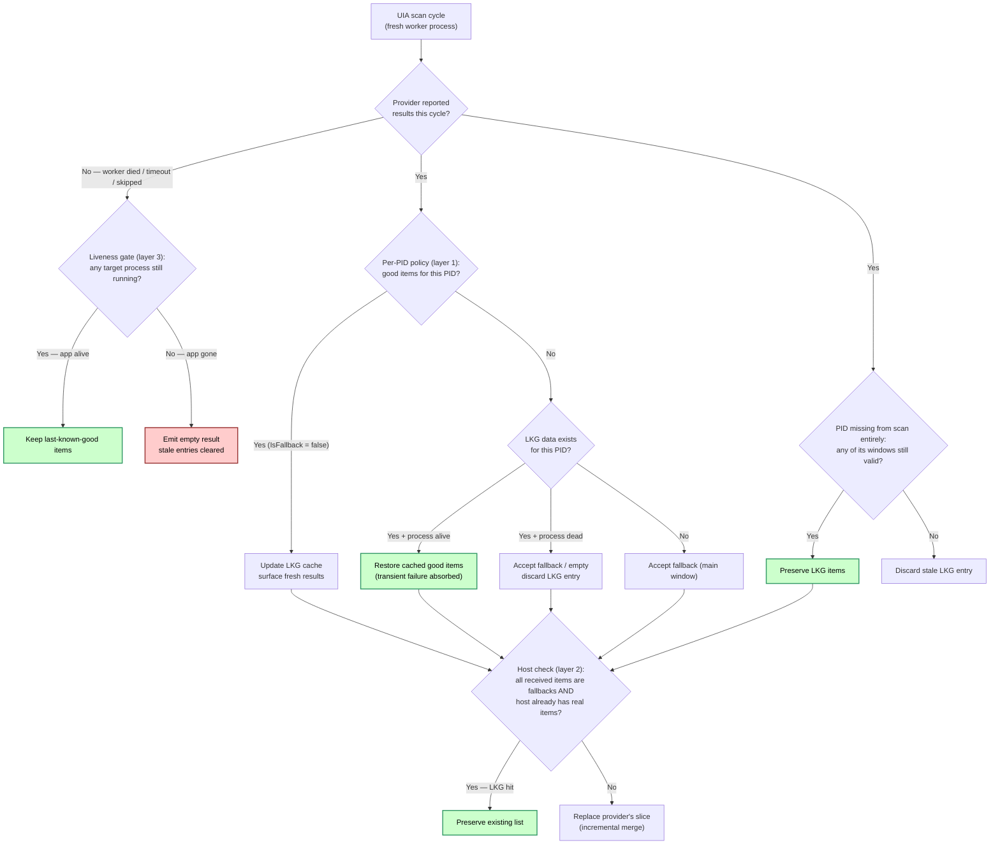
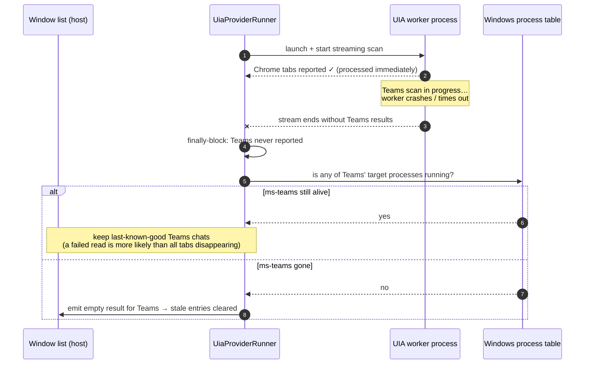
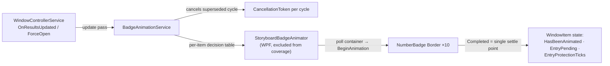
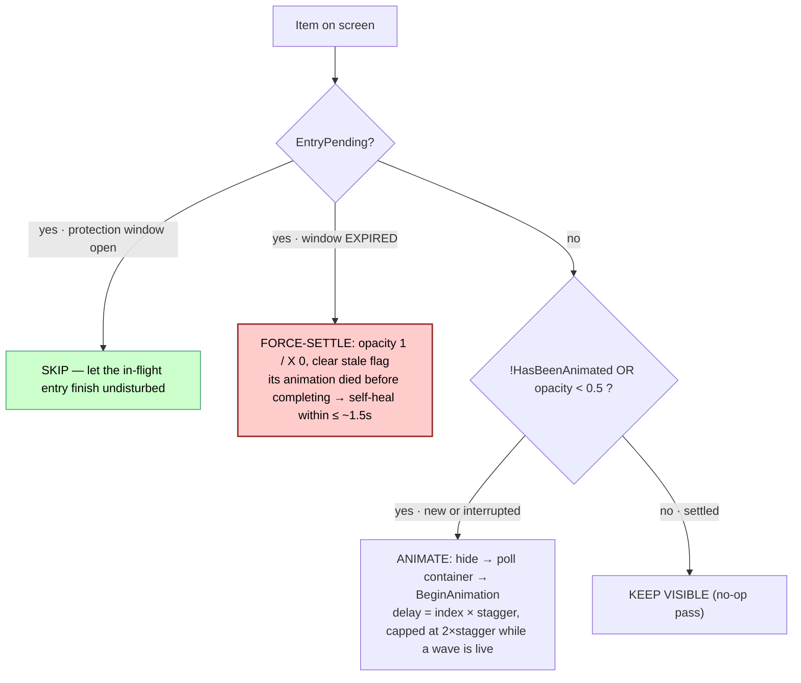

# SwitchBlade Technical Documentation

**Current Version: 1.9.17**

[](https://jamesericwong.github.io/switchblade/)

## 📚 Documentation

| Document | Description |
|----------|-------------|
| [CHANGELOG.md](CHANGELOG.md) | Version history and release notes |
| [PLUGIN_DEVELOPMENT.md](PLUGIN_DEVELOPMENT.md) | Guide for creating custom plugins |
| [BUILD.md](BUILD.md) | Build instructions and project setup |

---

## Overview
SwitchBlade is a high-performance Keyboard-Driven Window Switcher for Windows. It is built using **C# / WPF** and follows the **MVVM (Model-View-ViewModel)** architectural pattern. It is designed to be extensible via a robust Plugin System, allowing it to index not just top-level windows but also internal document tabs as searchable items.

The package comes with several specialized plugins out of the box:
- **Window Finder**: Discovers all standard top-level desktop application windows.
- **Chrome Tab Finder**: Indexes individual tabs from Google Chrome, Microsoft Edge, and other Chromium-based browsers.
- **Windows Terminal**: Discovers and allows switching between multiple tabs within Windows Terminal instances.
- **Notepad++**: Indexes and switches between individual open files/tabs in Notepad++.
- **Microsoft Teams**: Discovers and switches between individual chat conversations in Microsoft Teams (v2).


## Basic Usage

- **Toggle SwitchBlade**: Press `Ctrl + Shift + Q` (Default) to show or hide the search window.
- **Search**: Start typing immediately to filter open windows and tabs.
- **Navigate**: Use `Up` / `Down` arrows to select a window.
- **Activate**: Press `Enter` to switch to the selected window.
- **Close**: Press `Escape` to hide SwitchBlade without switching.

## Keyboard Shortcuts

SwitchBlade supports the following keyboard shortcuts for navigation:

| Key | Action |
| :--- | :--- |
| `↑` / `↓` | Move selection up/down by one item |
| `Page Up` / `Page Down` | Move selection up/down by one visible page |
| `Ctrl+Home` | Jump to the first item |
| `Ctrl+End` | Jump to the last item |
| `Enter` | Activate the selected window |
| `Escape` | Hide the SwitchBlade window |
| `Alt+1` to `Alt+0` | Quick-switch to windows 1-10 (configurable modifier) |

## Architecture

### Core Components
- **MainViewModel**: The central brain of the application. It orchestrates window provider execution, aggregates results, and manages the search/filter state.
- **Service Layer**: 
  - `SettingsService`: Manages persistence of user preferences (Registry-based).
  - `HotKeyService`: Handles global low-level keyboard hooks for the toggle hotkey.
  - `WindowOrchestrationService`: Coordinates window discovery, reconciliation, and provider result aggregation via two execution strategies — `InProcessProviderRunner` (fast providers as parallel in-process tasks) and `UiaProviderRunner` (UIA plugins out-of-process via `UiaWorkerClient`).
  - `WindowControllerService`: Controls window show/hide, backdrop, fade animations, and the force-open state machine (extracted from `MainWindow` code-behind for testability).
  - `BadgeAnimationService`: Drives the staggered Alt+Number badge animations.
- **Shared Kernel** (`SwitchBlade.Contracts`, WPF-free): Contracts + non-UI helpers shared with plugins, including `CachingScanCoordinator` (single-flight scan dedup + cache) and `LastKnownGoodStrategy` (per-PID LKG retention during transient failures), composed by `CachingWindowProviderBase`. The full three-layer failure-handling/LKG design is documented in [Failure Handling & Last-Known-Good (LKG) Stabilization](#failure-handling--last-known-good-lkg-stabilization).
- **Shared UIA Helper** (`SwitchBlade.Contracts.Uia`): `UiaElementResolver` — shared 3-stage HWND→FindFirst→TreeWalker fallback for UIA plugins.
- **Window Providers**: Independent modules responsible for scanning and returning `WindowItem` objects.


```mermaid
graph TD
    User((User)) -->|Hotkey| HotKeyService
    User -->|Types| SearchText[Search Input]
    SearchText -->|Triggers| MainViewModel
    HotKeyService -->|Toggle| WindowControllerService

    subgraph Core Application
        MainViewModel -->|Manages| SearchState
        MainViewModel -->|Searches via| SearchSvc[WindowSearchService]
        SearchSvc -->|Hits| RegexCache[LRU Regex Cache + FuzzyMatcher]
        MainViewModel -->|Reads/Writes| SettingsService
        MainViewModel -->|Delegates scans to| Orchestration[WindowOrchestrationService]
        WindowControllerService -->|Show/Hide, Animations| MainWindow[MainWindow UI]
    end

    subgraph Provider Execution
        Orchestration -->|Fast providers - parallel tasks| InProcRunner[InProcessProviderRunner]
        Orchestration -->|UIA plugins| UiaRunner[UiaProviderRunner]
        UiaRunner -->|NDJSON stream| Worker[UiaWorker.exe]
    end

    subgraph Data Sources
        InProcRunner -.-> WindowFinder
        Worker -.-> ChromeTabFinder
        Worker -.-> TerminalPlugin
        Worker -.-> NotepadPlusPlusPlugin
        Worker -.-> TeamsPlugin
    end

    MainViewModel -->|Aggregates| WindowList[Filtered Window List]
    WindowFinder -->|Yields| WindowItem
    ChromeTabFinder -->|Yields| WindowItem
    TerminalPlugin -->|Yields| WindowItem
    NotepadPlusPlusPlugin -->|Yields| WindowItem
    TeamsPlugin -->|Yields| WindowItem
    
    style RegexCache fill:#f9f,stroke:#333,stroke-width:2px,color:black
```

## Performance

SwitchBlade 1.5.1+ utilizes bleeding-edge .NET 9 features to ensure minimal resource footprint and maximum responsiveness.

### Key Optimizations
- **Zero-Allocation Window Scanning**: Uses `Span<char>`, `stackalloc` and `Unsafe` pointers to retrieve window titles and binary paths without generating garbage (GC pressure).
- **Source-Generated Interop**: Replaces slow `[DllImport]` with high-performance `[LibraryImport]` for all Windows API calls, ensuring trimming and AOT compatibility.
- **Modern Async Polling**: Uses `PeriodicTimer` for lock-free, efficient background updates.
- **Smart Caching**: Process names, paths, and icons come from a concurrent cache to minimize kernel transitions and I/O.
- **Configurable Regex caching**: Implements an LRU (Least Recently Used) cache for compiled regex objects to ensure buttery-smooth search responsiveness during rapid typing.
- **Immune to ReDoS**: Dynamically switches to the `.NET 9 NonBacktracking` engine for all user-provided patterns, providing guaranteed linear-time matching and protection against malicious regex hangs.
- **ReadyToRun (R2R) Deployment**: Pre-compiled native code in the binary reduces startup time and eliminates JIT warm-up latency.


```mermaid
graph TD
    subgraph UI Thread
        UI[Main Window]
        RC[LRU Regex Cache]
        NB[NonBacktracking Engine]
    end

    subgraph Background Service
        BP[BackgroundPollingService]
        PT["PeriodicTimer (Async)"]
    end

    subgraph Core Logic
        WF[WindowFinder]
        NI[NativeInterop]
    end

    subgraph Windows OS
        API1[EnumWindows]
        API2[GetWindowTextW]
    end

    %% Discovery Path
    UI -- Dispatcher --> BP
    BP -- Await Tick --> PT
    BP -- Refresh --> WF
    WF -- StackAlloc Buffer --> NI
    NI -- LibraryImport --> API1
    NI -- Unsafe Pointer --> API2

    %% Search Path
    UI -- User Input --> RC
    RC -- Cache Hit/Miss --> NB
    NB -- Guaranteed O(n) --> UI

    style NI fill:#f9f,stroke:#333,stroke-width:2px,color:black
    style WF fill:#bbf,stroke:#333,stroke-width:2px,color:black
    style RC fill:#f9f,stroke:#333,stroke-width:2px,color:black
    style NB fill:#bbf,stroke:#333,stroke-width:1px,color:black
```

## Fuzzy Search

SwitchBlade 1.6.0 introduces intelligent fuzzy search that makes finding windows effortless.

### Features

| Feature | Description | Example |
|:--------|:------------|:--------|
| **Delimiter Equivalence** | Spaces, underscores, and dashes are treated identically | `hello there` matches `hello_there` |
| **Subsequence Matching** | Characters must appear in order but not consecutively | `gc` matches `Google Chrome` |
| **Case Insensitive** | Matching ignores letter case | `CHROME` matches `chrome` |
| **Relevance Sorting** | Best matches appear first based on scoring | Exact matches rank highest |

### Scoring System

Fuzzy search ranks results using a weighted scoring algorithm:

| Bonus | Points | Awarded When |
|:------|:------:|:-------------|
| Base Match | +1 | Each matched character |
| Contiguity | +2 | Consecutive character matches |
| Word Boundary | +3 | Match at start of title |
| Starts-With | +5 | Title begins with query |


```mermaid
flowchart TD
    Start[User Types Query] --> FastPath{Exact Substring?}
    FastPath -- Yes --> ExactScore[Calculate Exact Score + Bonuses]
    FastPath -- No --> Normalize
    
    subgraph Zero-Allocation Pipeline
        Normalize[Normalize Title & Query]
        Normalize --> |stackalloc buffer| RemoveDelim[Remove Spaces/Underscores/Dashes]
        RemoveDelim --> |Span char| ToLower[Convert to Lowercase]
    end
    
    ToLower --> LengthCheck{Query <= Title?}
    LengthCheck -- No --> NoMatch[Return 0]
    LengthCheck -- Yes --> Subsequence
    
    subgraph Subsequence Matching
        Subsequence[Find Characters in Order]
        Subsequence --> |For each match| AddBase[+1 Base Score]
        AddBase --> Contiguous{Previous was adjacent?}
        Contiguous -- Yes --> AddCont[+2 Contiguity Bonus]
        Contiguous -- No --> CheckStart
        AddCont --> CheckStart{At position 0?}
        CheckStart -- Yes --> AddBoundary[+3 Word Boundary]
        CheckStart -- No --> NextChar[Continue]
        AddBoundary --> NextChar
    end
    
    NextChar --> AllFound{All chars found?}
    AllFound -- No --> NoMatch
    AllFound -- Yes --> StartsCheck{Started at pos 0?}
    StartsCheck -- Yes --> AddStarts[+5 Starts-With Bonus]
    StartsCheck -- No --> FinalScore
    AddStarts --> FinalScore[Return Total Score]
    ExactScore --> SortResults
    FinalScore --> SortResults[Sort by Score DESC]
    
    style Normalize fill:#f9f,stroke:#333,stroke-width:2px,color:black
    style RemoveDelim fill:#f9f,stroke:#333,stroke-width:2px,color:black
    style ToLower fill:#f9f,stroke:#333,stroke-width:2px,color:black
```

### Configuration

- **Enable/Disable**: Toggle in Settings → Search & Performance → "Enable Fuzzy Search"
- **Default**: Enabled
- **Fallback**: When disabled, uses legacy regex/substring matching

## Development

For information on how to build the project and create plugins, please refer to the following guides:

- [Build Instructions](BUILD.md): Detailed steps for setting up your environment, building SwitchBlade, and running unit tests.
- [Plugin Development Guide](PLUGIN_DEVELOPMENT.md): A comprehensive guide on building custom plugins for window discovery.

### Unit Tests
The project includes comprehensive xUnit tests in `SwitchBlade.Tests/`. Run tests with:
```powershell
dotnet test SwitchBlade.Tests/SwitchBlade.Tests.csproj
```

### Plugin System
SwitchBlade uses a contract-based plugin architecture.
- **Interface**: `SwitchBlade.Contracts.IWindowProvider`
- **Mechanism**: On startup, `PluginLoader` scans the `Plugins` directory for DLLs implementing `IWindowProvider`.
- **Isolation**: Non-UIA plugins run in-process; UIA plugins (`IsUiaProvider = true`) execute inside the transient `SwitchBlade.UiaWorker.exe`. All results are logically isolated by the `WindowItem.Source` property (see [PLUGIN_DEVELOPMENT.md](PLUGIN_DEVELOPMENT.md) for the full contract, including the composable scan services).

## Command-Line Arguments

SwitchBlade supports the following command-line parameters (prefixes `/`, `--`, or `-` are all supported):

| Parameter | Description |
| :--- | :--- |
| `/debug` | Enables verbose logging. Logs are saved to `%TEMP%\switchblade_debug.log`. |
| `/minimized` | Starts the application in the system tray without showing the main window. |
| `/enablestartup` | Used by the installer to enable "Launch on Startup" in the Windows Registry on first run. |

## Window Discovery Logic

SwitchBlade uses a two-tier architecture for window discovery: fast in-process scanning for standard windows, and out-of-process UIA scanning for specialized plugins with **streaming results**.

### Streaming NDJSON Protocol (v1.8.2+)

UIA plugins run in parallel and emit results immediately as each completes. This eliminates the blocking behavior where fast plugins waited for slow ones.


```mermaid
sequenceDiagram
    participant Main as SwitchBlade (Main)
    participant Worker as UiaWorker.exe
    participant Chrome as ChromeTabFinder
    participant Terminal as WindowsTerminal

    Main->>Worker: Start process, send JSON request
    
    par Parallel Plugin Execution
        Worker->>Chrome: GetWindows()
        Worker->>Terminal: GetWindows()
    end
    
    Chrome-->>Worker: Results (15ms)
    Worker-->>Main: {"pluginName":"Chrome","windows":[...]}
    Note over Main: UI updates immediately with Chrome tabs
    
    Terminal-->>Worker: Results (2000ms)
    Worker-->>Main: {"pluginName":"Terminal","windows":[...]}
    Note over Main: Terminal tabs appear when ready
    
    Worker-->>Main: {"isFinal":true}
    Worker->>Worker: Exit (releases all COM objects)
```

### Architecture Overview


```mermaid
flowchart LR
    Start[Start Scan] --> Parallel{Parallel Execution}
    Parallel -->|Task 1| WF["WindowFinder (In-Process)"]
    Parallel -->|Task 2| UIA[UiaWorkerClient]
    
    subgraph "Main Process"
        WF --> Enum[EnumWindows]
        Enum --> Filter{Is Visible?}
        Filter -- Yes --> Exclude{Handling Plugin Exists?}
        Exclude -- No --> Result1[Add WindowItem]
    end

    subgraph "Child Process (SwitchBlade.UiaWorker.exe)"
        UIA -->|JSON over Stdin| Plugins[Parallel Plugins]
        Plugins --> CTF[ChromeTabFinder]
        Plugins --> WTP[WindowsTerminalPlugin]
        Plugins --> NPP[NotepadPlusPlusPlugin]
        
        CTF -->|Stream| NDJSON[NDJSON Output]
        WTP -->|Stream| NDJSON
        NPP -->|Stream| NDJSON
    end
    
    Result1 --> UI[Update UI]
    NDJSON -->|IAsyncEnumerable| UI
```

### Key Benefits

| Aspect | Before (v1.8.1) | After (v1.8.2) |
|--------|-----------------|----------------|
| **Fast Plugin Visibility** | Blocked until all complete | Immediate |
| **Plugin Execution** | Sequential | Parallel |
| **Protocol** | Single JSON response | Streaming NDJSON |
| **User Experience** | Delayed "all at once" | Progressive "pop-in" |

### 1. Core Window Finder (`WindowFinder.cs`)
This is the built-in provider for standard desktop applications.
- **Method**: Uses the Win32 `EnumWindows` API to iterate over all top-level windows on the desktop.
- **Filtering**:
  - Checks `IsWindowVisible`.
  - Filters out known system noise (e.g., "Program Manager").
  - **Zero-Allocation Process Lookup**: Uses specialized native APIs (`QueryFullProcessImageName`) instead of the heavy .NET `Process` class to identify window owners without allocating managed memory.
  - **Smart De-Duplication**: The orchestrator collects each plugin's declared handled processes (`IProviderExclusionSettings.GetHandledProcesses`) and pushes them to `WindowFinder` via `SetExclusions`. If a window belongs to one of those processes (or is user-configured as excluded), `WindowFinder` **excludes** it. This prevents double-entries where both the generic window title and the specific tabs would appear.

### 2. Chrome Tab Finder (`ChromeTabFinder.cs`)
A specialized plugin for Chromium-based browsers (Chrome, Edge, Brave, Comet, etc.).
- **Execution Mode**: Runs **Out-of-Process** via `SwitchBlade.UiaWorker.exe` to prevent native memory leaks.
- **Discovery Strategy**:
  1.  **Process Identification**: Identifies target processes by name (configurable).
  2.  **Window Enumeration**: Uses `EnumWindows` (Win32) to find **ALL** top-level windows belonging to those PIDs.
  3.  **UI Automation**: Attaches to each window using `System.Windows.Automation`.
  4.  **Tree Traversal**: Performs a Breadth-First Search (BFS) of the automation tree to find elements with `ControlType.TabItem`.

#### Thread Safety & Isolation
Since this plugin runs in a separate process, it is immune to the "FindAll" memory leak inherent in Windows 11's UIA framework. When the worker process exits after scanning, all accumulated COM references are instantly released by the OS.

### 3. Windows Terminal Plugin (`WindowsTerminalPlugin.cs`)
A specialized plugin for Microsoft's Windows Terminal.
- **Execution Mode**: Runs **Out-of-Process** via `SwitchBlade.UiaWorker.exe`.
- **Discovery Strategy**:
  1.  **Process Identification**: Identifies target processes by name (default: "WindowsTerminal", configurable via settings).
  2.  **UI Automation**: Attaches to each identified window via the shared `UiaElementResolver` (HWND → FindFirst → TreeWalker fallback).
  3.  **Tree Traversal (`ScanForTabs`)**: Performs a Breadth-First Search (BFS) of the automation tree — capped at 200 containers checked, pruning `Document` branches — to find `ControlType.TabItem` elements, with a native `Descendants` search as fallback if BFS finds nothing.
- **Fallback Mechanism**: If no tabs are discovered (often due to elevation/UIPI restrictions when SwitchBlade is not elevated), the plugin returns the main terminal window as a single searchable item.
- **Activation**:
  1.  Brings the main window to the foreground.
  2.  Uses UI Automation patterns (`SelectionItemPattern` or `InvokePattern`) to programmatically select the specific tab requested by the user.

### 4. Notepad++ Plugin (`NotepadPlusPlusPlugin.cs`)
Indexes and switches between individual open files/tabs in Notepad++.
- **Execution Mode**: Runs **Out-of-Process** via `SwitchBlade.UiaWorker.exe`.
- **Mechanism**: Similar to the Terminal plugin, it uses UI Automation to traverse the document tabs in Notepad++.
- **Strategy**: Identifies `notepad++` processes and scans for tab items to allow direct file-level switching.

### 5. Microsoft Teams Plugin (`TeamsPlugin.cs`)
A specialized plugin for Microsoft Teams (v2/New Teams).
- **Execution Mode**: Runs **Out-of-Process** via `SwitchBlade.UiaWorker.exe` to isolate the main application from WebView2 memory characteristics.
- **Discovery Strategy**:
  1. **Process Identification**: Identifies `ms-teams` processes.
  2. **Chat Parsing**: Scans the UI tree for `TreeItem` elements representing chats. Parses contact names and statuses (e.g., "Available", "Busy") using regex patterns derived from extensive testing.
  3. **Chat Types**: Distinguishes between Individual, Group, and Meeting chats.
- **Activation**:
  - Uses a robust "Pattern Cascade" to activate chats:
    1. `InvokePattern` (Click)
    2. `SelectionItemPattern` (Select)
    3. `ExpandCollapsePattern` (Expand)
    4. `SetFocus` (Fallback)
  - This ensures reliable switching regardless of the specific UI state of the chat item.

## Async & Threading Model

### Parallel Execution
SwitchBlade does NOT block the UI thread while searching.
- When `RefreshWindows()` is called, `WindowOrchestrationService` runs fast (non-UIA) providers as separate parallel `Task`s on the ThreadPool — one per provider. The fast `WindowFinder` typically finishes in <10ms.
- UIA plugins run out-of-process inside `SwitchBlade.UiaWorker.exe`, also in parallel, and stream results back as each completes (see above).

### UI Marshalling
- As each background task completes, it marshals its results back to the UI thread via the WPF Dispatcher (`IDispatcherService`).
- This creates a "Pop-in" effect where core windows appear instantly, followed shortly by browser tabs.

## Smart Refresh & List Merge Strategy

SwitchBlade uses a sophisticated incremental update strategy to keep the window list stable and prevent visual disruption during updates. The goal is to never clear the list and re-add all items, which would cause flickering and loss of user context.

### Persistence Strategy
1. **No Clear-On-Toggle**: When the Global Hotkey is pressed, the list is **NOT** cleared. The user immediately sees the results from the *previous* session while background scans run.
2. **Provider-Isolated Updates**: Each window provider (e.g., `WindowFinder`, `ChromeTabFinder`) updates its own slice of the list independently. Changes from one provider don't affect items from other providers.

### Incremental Merge Algorithm (O(N) Optimized)

SwitchBlade uses a high-performance, two-phase synchronization algorithm to update the UI collection without full list refreshes. This ensures selection persistence and buttery-smooth animations.


```mermaid
flowchart TD
    Start["Source List Received"] --> Phase1["Phase 1: Cleanup"]
    Phase1 --> BuildSet["Build HashSet of Source Items"]
    BuildSet --> ReverseLoop["Loop Collection Backwards"]
    ReverseLoop --> Exists{"In SourceSet?"}
    Exists -- No --> Remove["RemoveAt i"]
    Exists -- Yes --> NextDel["Next Item"]
    
    Remove --> NextDel
    NextDel -->|Done| Phase2["Phase 2: O(N) Two-Pointer Sync"]
    
    Phase2 --> InitPtr["Set ptr = 0"]
    InitPtr --> SourceLoop["Loop through Source"]
    SourceLoop --> Match{"collection[ptr] == source[i]?"}
    
    Match -- Yes --> IncPtr["ptr++"]
    IncPtr --> SourceLoop
    
    Match -- No --> Find["Search Forward for Item"]
    Find --> Found{"Found?"}
    
    Found -- Yes --> Move["collection.Move foundAt -> ptr"]
    Move --> IncPtr
    
    Found -- No --> Insert["collection.Insert ptr, item"]
    Insert --> IncPtr
    
    SourceLoop -->|Complete| End["Sync Finished"]
    
    style Phase2 fill:#f9f,stroke:#333,stroke-width:2px,color:black
    style Match fill:#bbf,stroke:#333,stroke-width:2px,color:black
```

#### Phase 1: Reconciliation (Cleanup)
Identifies and removes items that are no longer part of the current search results. Using a `HashSet<WindowItem>` ensures existence checks are $O(1)$.

#### Phase 2: Two-Pointer Sync (Order & Stability)
Synchronizes the collection order with the source list using a single pass ($O(N)$). It minimizes UI thread workload by only issuing `Move` or `Insert` commands when structural changes are detected. By searching forward from the current pointer, it avoids the $O(N^2)$ penalty of multiple `IndexOf` calls.

### Selection Preservation

During list updates, the selection behavior is controlled by the **List Refresh Behavior** setting:

| Setting | Behavior |
| :--- | :--- |
| **Preserve scroll position** (default) | Selection is updated silently. The scroll position stays exactly where it was. The view does NOT auto-scroll to the selected item. |
| **Follow selected window (Identity)** | Selection follows the same **window identity** (Hwnd + Title). If your selected window moves, the list auto-scrolls to keep it visible. |
| **Keep selection index (Position)** | Selection stays at the current **index position**. If you're viewing item #3, you'll still be viewing item #3 after refresh (even if the window at that position changed). The list auto-scrolls to the new selection. |

### Diff Key Design

Chrome tabs share the same `Hwnd` (the browser window handle), so we use a composite key:
```
Identity = (Hwnd, Title)
```
This allows us to:
- Distinguish between tabs in the same browser window
- Detect when a tab's title has changed (e.g., page navigation)
- Properly track selection across refreshes

### Thread Safety

The merge operation runs on background threads via `Task.Run()`, but all mutations to `_allWindows` and `FilteredWindows` are marshalled to the UI thread via `Dispatcher.Invoke()`. This ensures:
- No race conditions on the ObservableCollection
- WPF bindings receive proper change notifications
- The UI remains responsive during long scans

### Failure Handling & Last-Known-Good (LKG) Stabilization

UI Automation reads against live third-party processes fail transiently and often — element invalidation, provider-process hiccups, elevated windows. Rather than surfacing those failures as "all your tabs disappeared", SwitchBlade stabilizes results through **three cooperating layers**, each answering the same question: *is this a failed read, or did the windows really go away?*

> **Design rule:** *"the plugin failed to read" is always more likely than "all tabs actually disappeared"* — so when in doubt, keep the last known good state.

| Layer | Where it runs | What it does |
| :--- | :--- | :--- |
| **1 · Plugin level** (per-PID LKG) | Inside the UIA worker process: `CachingWindowProviderBase.GetWindows()` → `LastKnownGoodStrategy.Apply()`, wrapped by `CachingScanCoordinator` | Good results (`IsFallback = false`) update the per-PID LKG cache. A fallback-only scan for a PID whose process is still alive **restores** the cached good items. PIDs missing from a scan keep their data while any of their windows remain valid, otherwise it is discarded. If the scan throws, the coordinator returns the last successful cache. |
| **2 · Host level** (provider LKG hit) | `WindowOrchestrationService.ProcessProviderResults` | If everything received is fallback items *and* the host already has real items for that provider → the existing list is preserved, not replaced. This covers e.g. a freshly restarted worker whose in-memory LKG cache is empty. |
| **3 · Never-reported gate** (liveness) | `UiaProviderRunner` finally-block — runs when a provider produced *no* results at all (worker death mid-stream, per-plugin timeout, worker-side load error) | Checks the OS process table for the provider's target processes: app still running → keep last-known-good items; app gone → emit an empty result so stale entries are cleared. |

The `IsFallback` flag is propagated across the host↔worker IPC boundary — it is what lets layers 1 and 2 tell "failed read" apart from "genuinely no tabs".

#### Decision Flow


```mermaid
flowchart TD
    A["UIA scan cycle<br/>(fresh worker process)"] --> B{"Provider reported<br/>results this cycle?"}

    B -- "No — worker died / timeout / skipped" --> C{"Liveness gate (layer 3):<br/>any target process still running?"}
    C -- "Yes — app alive" --> D["Keep last-known-good items"]
    C -- "No — app gone" --> E["Emit empty result<br/>stale entries cleared"]

    B -- Yes --> F{"Per-PID policy (layer 1):<br/>good items for this PID?"}
    F -- "Yes (IsFallback = false)" --> G["Update LKG cache<br/>surface fresh results"]
    F -- No --> H{"LKG data exists<br/>for this PID?"}
    H -- "Yes + process alive" --> I["Restore cached good items<br/>(transient failure absorbed)"]
    H -- "Yes + process dead" --> J["Accept fallback / empty<br/>discard LKG entry"]
    H -- No --> K["Accept fallback (main window)"]

    B -- Yes --> R{"PID missing from scan entirely:<br/>any of its windows still valid?"}
    R -- Yes --> I2["Preserve LKG items"]
    R -- No --> J2["Discard stale LKG entry"]

    G & I & J & K & I2 --> L{"Host check (layer 2):<br/>all received items are fallbacks AND<br/>host already has real items?"}
    L -- "Yes — LKG hit" --> M["Preserve existing list"]
    L -- No --> N["Replace provider's slice<br/>(incremental merge)"]

    style D fill:#cfc,stroke:#396,stroke-width:2px,color:black
    style E fill:#fcc,stroke:#933,stroke-width:2px,color:black
    style I fill:#cfc,stroke:#396,stroke-width:2px,color:black
    style I2 fill:#cfc,stroke:#396,stroke-width:2px,color:black
    style M fill:#cfc,stroke:#396,stroke-width:2px,color:black
```

Green = last-known-good state preserved · Red = stale entries cleared.

#### Worker Death Mid-Stream (Layer 3 in Action)


```mermaid
sequenceDiagram
    autonumber
    participant UI as Window list (host)
    participant R as UiaProviderRunner
    participant W as UIA worker process
    participant OS as Windows process table

    R->>W: launch + start streaming scan
    W-->>R: Chrome tabs reported ✓ (processed immediately)
    Note over W: Teams scan in progress…<br/>worker crashes / times out
    W--xR: stream ends without Teams results

    R->>R: finally-block: Teams never reported
    R->>OS: is any of Teams' target processes running?

    alt ms-teams still alive
        OS-->>R: yes
        Note over UI,R: keep last-known-good Teams chats<br/>(a failed read is more likely than all tabs disappearing)
    else ms-teams gone
        OS-->>R: no
        R->>UI: emit empty result for Teams → stale entries cleared
    end
```

#### Edge Cases
- **Unresolvable PIDs** (sentinel `0`): surfaced as-is, without LKG tracking — they can't be grouped by process, so stabilization would mix unrelated windows together.
- **App alive but all its windows closed**: layer 3 keeps the stale entries until the next *successful* scan reports empty and clears them through the normal path (self-healing).
- **Layer 1's cache is per worker-process lifetime** — a restarted worker starts with an empty LKG cache, which is exactly when layer 2 takes over.

## Run as Administrator

Some plugins require elevated privileges to fully inspect certain windows (e.g., tabs in an elevated Terminal or other admin-level applications).

### Configuration
- **Toggle**: Found in Settings → "Run as Administrator"
- **Default**: Off (disabled)
- **Effect**: When enabled, SwitchBlade displays a UAC prompt on startup

### Behavior
When the setting is toggled:
1. The setting is saved immediately
2. A dialog prompts the user to restart
3. On next startup, SwitchBlade requests elevation via UAC

> **Note**: If "Launch on Windows Startup" is also enabled, and the user wants automatic elevation, they may need to configure a Scheduled Task with "Run with highest privileges" instead of the standard Run registry entry.

## Background Polling

SwitchBlade supports optional background polling to keep the window list up-to-date even when the application is not in focus.

### Configuration
- **Enable Background Polling**: Toggle in Settings (default: enabled).
- **Polling Interval**: Configurable in Settings (default: 30 seconds; a minimum of 1 second is enforced at runtime).

### Concurrency Protection & Lock Detection
The `BackgroundPollingService` runs a single sequential polling loop built on .NET's async `PeriodicTimer`: each tick awaits the previous refresh before the next one starts, so refreshes can never overlap. It also detects when the workstation is locked and skips that tick — UIA/COM calls against a locked desktop can hang for 10-15s and would otherwise make the app unresponsive on wake.

## Number Shortcuts

SwitchBlade supports number shortcuts for instant window switching. When enabled, holding the modifier key and pressing a number key (1-9 or 0) will immediately activate the corresponding window in the list.

### Key Mapping
| Keys | Window Position |
| :---: | :---: |
| `Alt+1` | 1st window |
| `Alt+2` | 2nd window |
| ... | ... |
| `Alt+9` | 9th window |
| `Alt+0` | 10th window |

### Configuration
- **Enable Number Shortcuts**: Toggle in Settings (default: enabled)
- **Shortcut Modifier**: Choose Alt, Ctrl, Shift, or None (default: Alt)
- Supports both main keyboard number row and NumPad keys
- When enabled, number badges appear next to the first 10 windows in the list

### Smooth Reordering
The window list maintains a stable sort (by Process Name → Title → Handle) to minimize visual disruption when new windows appear. Combined with the incremental merge strategy, the numbered positions update smoothly without full list refreshes.

### Badge Animation System

The Alt+Number badges feature a staggered animation that provides visual polish when the window list appears: each badge fades in and slides from left to right in sequence. Deceptively simple — until v1.8.2+ streaming discovery made the numbered list keep changing **while** the cascade is still running. The design below is the product of four field iterations, each one driven by a real user-visible failure mode: pop-in, out-of-order motion, flash, lag, and finally badges missing entirely. Every rule in it exists because some earlier version failed in exactly that way.

#### Architecture

| Layer | Type | Responsibility |
|:---|:---|:---|
| Trigger state machine | `WindowControllerService` (`Handlers/`) | Decides *when* a pass runs (results update, search-text change → deferred reset, force-open) and when full animation-state reset happens for deliberate re-animation. |
| Orchestration | `BadgeAnimationService` (`Services/`) | Debouncing, per-cycle cancellation, the per-item decision table below, protection-window stamping, completion-wait budget. Zero WPF types — fully unit-testable through fakes. |
| Execution seam | `IBadgeAnimator.Animate(item, delayMs, durationMs, offsetX, cancellationToken)` (`Services/`) | Strategy contract: a superseded cycle **must stop before touching any badge** (checkpoints at entry, mid-poll, pre-apply). Applied WPF animations are deliberately not tied to the token — they settle themselves. |
| WPF executor | `StoryboardBadgeAnimator` (`Services/`, `[ExcludeFromCodeCoverage]`) | Marshals to the UI thread, hides the badge's source state, polls for its realized `ListBoxItem` container (≤ 20 × 25ms), resolves the named `NumberBadge` border by visual-tree walk, starts paired opacity + translate animations with `HoldEnd`, and settles in a single `Completed` handler. |
| Coordination state | `WindowItem` (`SwitchBlade.Contracts`) | Three unbound auto-properties carry all inter-pass state: `HasBeenAnimated`, `EntryPending`, `EntryProtectionTicks`. No INPC, never bound to the UI. |


```mermaid
flowchart LR
    WC["WindowControllerService<br/>OnResultsUpdated / ForceOpen"] -->|"update pass"| BAS["BadgeAnimationService"]
    BAS -->|"cancels superseded cycle"| CT["CancellationToken per cycle"]
    BAS -->|"per-item decision table"| SBA["StoryboardBadgeAnimator<br/>(WPF, excluded from coverage)"]
    SBA -->|"poll container → BeginAnimation"| B["NumberBadge Border ×10"]
    B -->|"Completed = single settle point"| WI["WindowItem state:<br/>HasBeenAnimated · EntryPending ·<br/>EntryProtectionTicks"]
```

#### Timing Parameters

| Parameter | Value | Purpose |
|:---|:---|:---|
| **Stagger delay** | 75ms | Gap between each badge's start (`index × 75ms`) |
| **Duration** | 150ms, cubic ease-out | Per-badge fade-in + slide-in (opacity 0→1, X −20px→0) |
| **Debounce** | 75ms — skipped for hotkey / initial load | Waits for typing to settle; first paint on open stays ~200ms snappy |
| **Container poll budget** | ≤ ~500ms (20 × 25ms) | Wait for virtualization to realize a row before animating it |
| **Settle grace** | 800ms (`EntrySettleGraceMs`) | Headroom in the protection window beyond delay + duration (below) |

#### Per-item decision table (the actual algorithm)

Every trigger pass visits every visible shortcut item:


```mermaid
flowchart TD
    A[Item on screen] --> B{EntryPending?}
    B -- "yes · protection window open" --> C["SKIP — let the in-flight entry finish undisturbed"]
    B -- "yes · window EXPIRED" --> D["FORCE-SETTLE: opacity 1 / X 0, clear stale flag<br/>its animation died before completing → self-heal within ≤ ~1.5s"]
    B -- no --> E{"!HasBeenAnimated OR opacity < 0.5 ?"}
    E -- "yes · new or interrupted" --> F["ANIMATE: hide → poll container → BeginAnimation<br/>delay = index × stagger, capped at 2×stagger while a wave is live"]
    E -- "no · settled" --> G["KEEP VISIBLE (no-op pass)"]

    style C fill:#cfc,stroke:#396,color:black
    style D fill:#fcc,stroke:#933,stroke-width:2px,color:black
```

- **Skip (in-flight)**: re-hiding or re-delaying a badge whose entry animation has been applied is what made rapid streaming passes read as *flash and lag*. The in-flight entry settles itself via its `Completed` handler.
- **Force-settle (expired)**: the protection window exists because an in-flight animation can die without its completion handler ever firing — most commonly virtualization recycling (pitfalls below). A badge must never be skipped forever, so once the deadline passes a plain restore-to-visible heals it. Restore only — no hide, no dip — which is why healing itself is invisible on screen.
- **Animate**: badges that were hidden before their entry applied re-stagger on the next trigger instead of popping in instantly; joiners into an already-running wave get `min(index × stagger, 2 × stagger)` because their nominal slot has already passed by the time they arrive (waiting for it reads as lag).
- **Settle is a single point**: the animator's `Completed` handler syncs source values (`opacity = 1`, `X = 0`), clears `EntryPending`, and releases the HoldEnd hold so bindings reassert cleanly. Nothing else writes settled state.

#### Why this was tricky — incident history (all user-reported)

| Round | Symptom | Root cause | Fix (commit) |
|:---|:---|:---|:---|
| 1.9.17 baseline | Overlapping cascades, numbers jumping as late tab batches streamed in; inconsistent entry order | Streaming discovery means multiple renumber + trigger passes per open — against an animator designed for one clean cascade per open (pre-1.9.16 discovery aborted late tabs on COM faults, so multi-batch arrival was rare and the inconsistency stayed latent) | v1: per-cycle `CancellationToken` with a strict *"superseded cycle stops before touching any badge"* contract (`7b6d91a`) |
| 2 | Rapid hotkey toggles → badges **pop in with no stagger**; sometimes a higher number moves before a lower one | A superseded cycle left some badges hidden but marked *animated*, so the next pass force-showed them instantly (zero animation) | v2: animate condition `!HasBeenAnimated ∥ opacity < 0.5` — interrupted-but-hidden badges **re-stagger** on the next trigger (`555c550`) |
| 3 | "Better, but worse than 1.9.16 — a **flash**, and feels unintentionally **lagged**" | The v1/v2-era renumber pulse was itself a visible dip (a blink), repeated per streaming batch; each pass also re-hid + re-delayed badges still mid-entry (hide → wait slot → show, repeating = flash+lag) | v3: renumber pulse **removed entirely** — 1.9.16's silent number swap is what reads as acceptable; new `EntryPending` in-flight protection (never disturb a running entry); capped joiner delays (`00881bd`) |
| 4 | **Badges missing**, scattered mid-list (e.g. only Alt+2,3,6,7,9,0 visible) until app restart | Recycling virtualization recycled row containers mid-entry → the animation died and its `Completed` never fired; v3's skip-trust then skipped that badge **forever** (a second death path: a superseded cycle's `BeginAnimation(prop, null)` release also suppresses completion) | v4 (**shipped**, `45f4e88`): bounded trust — service stamps `EntryProtectionTicks = now + delay + duration + 800ms grace` at dispatch; skip only while the window is open, force-settle past it. **Hard guarantee: no badge can stay hidden for more than ~1.5s under any failure mode.** |

#### WPF pitfalls that shaped this design

- **Virtualization kills animations silently**: `ResultList` runs on a recycling virtualization panel (`IsVirtualizing=True`, `Recycling`); when a list re-sort recycles a row's container, the active animation dies and its `Completed` event does **not** fire. This is why an in-flight flag must never be trusted unboundedly — only inside a stamped protection window with force-settle fallback (round 4).
- **Releasing an animation suppresses completion**: `BeginAnimation(prop, null)` interrupts without firing `Completed`. A superseded cycle that releases a badge's animation orphans its in-flight marker the same way.
- **Source state vs animated value are two planes**: hiding happens by setting `WindowItem.BadgeOpacity` / `BadgeTranslateX` (the binding plane); animating happens on the visual element (the render plane). While an active animation holds a property, source writes are invisible — which is also why "force-visible" healing can never pop or flash mid-animation.
- **HoldEnd + release pattern**: entry animations use `FillBehavior.HoldEnd` so the settled value survives until the handler syncs the bound source values and releases the hold (`BeginAnimation(prop, null)`), after which bindings reassert cleanly.

#### Regression coverage

Every incident above has a named red→green test in `SwitchBlade.Tests`:

- `Trigger_AnimatedButHiddenBadge_ReAnimatesInsteadOfPoppingIn` — round 2 pop-in (interrupted badge must re-stagger, never force-show instantly).
- `Trigger_EntryPending_ExpiredProtection_ForceSettlesInsteadOfStranding` — round 4 missing badges (stranded badge + expired protection window → force-visible, flag cleared, no re-animation).
- `Trigger_JoiningLiveCascade_UsesCappedDelay` / `Trigger_EntryPendingBadge_IsLeftUndisturbed` — round 3 in-flight protection and joiner cap.
- Token-cancellation tests: `StoryboardBadgeAnimatorTests.Animate_AlreadyCancelledToken_LeavesVisibleBadgeUntouched` (a cancelled cycle touches nothing) plus the mid-poll / debounce / final-wait cancellation paths in `BadgeAnimationServiceTests`.

Test-double rule that bites when forgotten: **fakes must settle on apply** — `Animate` sets `item.BadgeOpacity = 1.0`, mirroring production's `Completed` (constructor-level Moq Callback in `BadgeAnimationServiceTests`; same in the `FakeBadgeAnimator` used by the controller tests). An unsettled fake re-animates "interrupted" items forever under the corrected semantics and silently breaks three trigger tests.

#### Configuration
- **Enable Badge Animations**: Toggle in Settings (default: enabled)
- When disabled, badges appear instantly at full opacity
